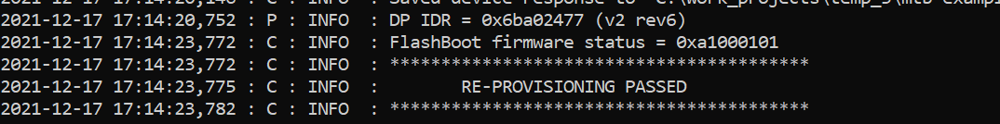

# Connecting to Azure IoT services using Azure SDK for Embedded C

## Introduction
The code example demonstrates connecting to the Azure IoT services using the Azure SDK for Embedded C and Infineon's Wi-Fi connectivity SDK. This code example demonstrates the features such as IoT hub - C2D (Cloud to Device), Telemetry, Methods, Twin, Provisioning, PnP (Plug and Play).

In this example, the [Azure C SDK port](https://github.com/Infineon/azure-c-sdk-port) is used with the [MQTT](https://github.com/Infineon/mqtt) library to connect to the Azure cloud. The IoT device authentication mode can either be X509 certificate-based or Shared Access Signature (SAS)-based. At startup, the application provides a menu displaying features of Azure IoT Hub service. Depending upon the use-case selected, the message transmission takes place either from cloud to the MCU device or vice-versa.

## Requirements

- [ModusToolbox&trade; software](https://www.cypress.com/products/modustoolbox-software-environment) v2.4 (tested with v2.4) or later.   
- Board support package (BSP) minimum required version: 3.0.0
- Programming language: C
- Associated parts: All [PSoC&trade; 6 MCU](https://www.cypress.com/PSoC6) parts, [AIROC™ CYW43012 Wi-Fi & Bluetooth® combo chip](https://www.cypress.com/products/cyw43012), [AIROC™ CYW4343W Wi-Fi & Bluetooth® combo chip](https://www.cypress.com/products/cyw4343w), [AIROC™ CYW4373 Wi-Fi & Bluetooth® combo chip](https://www.infineon.com/cms/en/product/wireless-connectivity/airoc-wi-fi-plus-bluetooth-combos/cyw4373), [AIROC™ CYW43439 Wi-Fi & Bluetooth® combo chip](https://www.infineon.com/cms/en/product/wireless-connectivity/airoc-wi-fi-plus-bluetooth-combos/cyw43439)


## Supported toolchains (make variable 'TOOLCHAIN')

- GNU Arm® embedded compiler v10.3.1 (`GCC_ARM`) - Default value of `TOOLCHAIN`
- Arm&reg; compiler v6.13 (`ARM`)
- IAR C/C++ compiler v8.42.2 (`IAR`)


## Supported kits (make variable 'TARGET')

- [PSoC&trade; 64 Standard Secure AWS Wi-Fi Bluetooth&reg; Pioneer Kit](https://www.cypress.com/documentation/development-kitsboards/psoc-64-standard-secure-aws-wi-fi-bt-pioneer-kit-cy8ckit) (`CY8CKIT-064S0S2-4343W`) – Default value of `TARGET`
- [PSoC&trade; 6 Wi-Fi Bluetooth&reg; prototyping kit](https://www.cypress.com/CY8CPROTO-062-4343W) (`CY8CPROTO-062-4343W`)
- [PSoC&trade; 6 Wi-Fi Bluetooth&reg; pioneer kit](https://www.cypress.com/CY8CKIT-062-WiFi-BT) (`CY8CKIT-062-WIFI-BT`)
- [PSoC&trade; 62S2 Wi-Fi Bluetooth&reg; pioneer kit](https://www.cypress.com/CY8CKIT-062S2-43012) (`CY8CKIT-062S2-43012`)
- [PSoC&trade; 62S1 Wi-Fi Bluetooth&reg; pioneer kit](https://www.cypress.com/CYW9P62S1-43438EVB-01) (`CYW9P62S1-43438EVB-01`)
- [PSoC&trade; 62S1 Wi-Fi Bluetooth&reg; pioneer kit](https://www.cypress.com/CYW9P62S1-43012EVB-01) (`CYW9P62S1-43012EVB-01`)
- [PSoC&trade; 62S2 evaluation kit](https://www.cypress.com/documentation/development-kitsboards/psoc-62s2-evaluation-kit-cy8ceval-062s2) (`CY8CEVAL-062S2-LAI-4373M2`,`CY8CEVAL-062S2-MUR-43439M2`)
- [PSoC&trade; 62S3 Wi-Fi Bluetooth&reg; prototyping kit](https://www.infineon.com/cms/en/product/evaluation-boards/cy8cproto-062s3-4343w/?utm_source=cypress&utm_medium=referral&utm_campaign=202110_globe_en_all_integration-dev_kit) (`CY8CPROTO-062S3-4343W`)

## Hardware setup
This example uses the board's default configuration. See the kit user guide to ensure that the board is configured correctly.


## Software setup

Install a terminal emulator if you don't have one. Instructions in this document use [Tera Term](https://ttssh2.osdn.jp/index.html.en).

This example requires the setup of Azure IoT hub on the Microsoft Azure portal. Also, the Visual Studio Code and its Azure IoT tool extension need to be set up with the created Azure Hub.

The following links may be referred:

- [Azure hub setup](https://docs.microsoft.com/en-us/azure/iot-hub/iot-hub-create-through-portal#create-an-iot-hub) <br>
                    
- [Visual studio code setup](https://code.visualstudio.com/download) <br>

- [Azure IoT Tools](https://marketplace.visualstudio.com/items?itemName=vsciot-vscode.azure-iot-tools)<br>

- [Set up your Azure IoT hub in VS Code](https://devblogs.microsoft.com/iotdev/introducing-azure-iot-tools-for-visual-studio-code/#set-up-your-azure-iot-hub-in-vs-code)<br>


## Authentication credentials setup

This section contains the steps to set up the X509 or SAS credentials on the hardware for the Azure IoT hub.

<details><summary><b>Credentials setup for Non-secured platform </b></summary>

For SAS based authentication, the token generation steps are mentioned in the correspondnig section of [Operation](#operation). <br>
For using X509 based certifiate authentication, the following steps may be referred.

   <details><summary><b>X509 certificate based authentication mode</b></summary>
   <br>
   The following steps can be used to generate the device's X509 self-signed certificate & private key and setup X509 authentication based device on Azure IoT hub. <br> <br>

   1. Run the following commands in the modus shell in the _certificates_ directory to generate the following X509 device certificate and keys.

      - <b>mydevkitkey.pem</b> will be the generated Private Key file.<br>
      - <b>mydevkitcertificate.pem</b> will be the generated actual x509 certificate file. <br> <br>

      ```
      $ openssl req -newkey rsa:2048 -nodes -keyout mydevkitkey.pem -x509 -days 365 -out mydevkitcertificate.pem
      ```

      When you run this command, you may need to enter additional information, as shown in the sample below. The `Common Name` field must match the name of the Azure IoT device that will be created.

      ```
      Country Name (2 letter code) [XX]:US 
      State or Province Name (full name) []:CA 
      Locality Name (eg, city) [Default City]:SJ 
      Organization Name (eg, company) [Default Company Ltd]:IFX 
      Organizational Unit Name (eg, section) []: CYPRESS 
      Common Name (eg, your name or your server's hostname) []:myazuredevID1 
      Email Address []: 
      ```
   2. Run the following command in the modus shell in the _certificates_ directory to get the SHA thumbprint of the device certificate created in the previous step. This will be used for device creation on Azure Portal.

      ```
      $ openssl x509 -in mydevkitcertificate.pem -fingerprint
      ``` 
      
      Following is an example of the required fingerprint from the output of the above command:

      ```
      SHA1 Fingerprint=B8:D4:E3:0F:E0:DB:07:12:8F:DF:59:E9:C6:C8:5F:70:8F:47:93:25
      ```
      
      Remove the “:” from the SHA fingerprint generated in the above step and copy it. Taking the above fingerprint as an example, the text to be copied is shown below:
      
      ```
      B8D4E30FE0DB07128FDF59E9C6C85F708F479325
      ```
   
   3. In the azure portal, refer to [Azure device setup](https://docs.microsoft.com/en-us/azure/iot-hub/iot-hub-create-through-portal#register-a-new-device-in-the-iot-hub) and create the Azure IoT device using _X509 self-signed option_. Paste the same fingerprint copied in the previous step in both “primary” and “secondary” thumbprints. The _device name_ should be same as `Common Name` used in the _step 1_ of this section where the Root certificate was created. <br>      

   4. In _source/mqtt_main.h_, Set azure_rootCA to the [Baltimore CyberTrust Root certificate](https://docs.microsoft.com/en-us/azure/security/fundamentals/tls-certificate-changes) and set device certificate & device key. The pem format of the certificates and keys needs to be used in the file. Use _scripts/format_X509_cert_key.py_ to generate the formatted pem to be used in _source/mqtt_main.h_. copy and paste this script in _certificates_ folder and use in the following way.

      ```
      $ python format_X509_cert_key.py mydevkitkey.pem
      ```

      **Note**: Refer to the [Baltimore CyberTrust Root certificate](https://docs.microsoft.com/en-us/azure/security/fundamentals/tls-certificate-changes) for the latest version of the certificate used for Azure IoT.

   </details>

</details>

<details><summary><b>Credentials setup for a secured platform (CY8CKIT-064S0S2-4343W)</b></summary>
<br>

### Initial Device Provisioning

_CY8CKIT-064S0S2-4343W_ requires provisioning of _keys_ and _policies_ into the hardware. These secure keys and policies are used during the _secure boot flow_. Refer to the [Secure Boot SDK user guide](https://www.infineon.com/dgdl/Infineon-PSoC_64_Secure_MCU_Secure_Boot_SDK_User_Guide-Software-v07_00-EN.pdf?fileId=8ac78c8c7d0d8da4017d0f8c361a7666&da=t) for details on _secure boot sdk_.

The following steps help in provisioning/re-provisioning of the device. The [Device provisioning guide](https://www.cypress.com/file/521106/download) will be used as reference. The _policies_ and _keys_ inside the _trusted-firmware-m_ library in the _mtb_shared_ folder needs to be used for device provisioning.

1. Perform the steps mentioned in _Install "Secure Boot" SDK_ section of the [Device provisioning guide](https://www.cypress.com/file/521106/download) to install the required tools and dependencies.

1. Navigate to the root of this code example (_< Azure application >_) in the modus-shell and run the command mentioned in _step 3_ of _Provision the Kit_ section of the [Device provisioning guide](https://www.cypress.com/file/521106/download). This command will generate _policy_, _keys_, and _packets_ folder.

   ```
   $ cysecuretools --target CY8CKIT-064S0S2-4343W init
   ```
1. Remove the default policies inside the _< Azure application >/policy_ folder which were generated in the above step.

1. Copy all the content from the _mtb_shared/trusted-firmware-m/< tag >/security/policy_ folder to the _< Azure application >/policy_ folder. 

   Now, the _< Azure application >/policy_ folder must have the following contents:

      - policy_multi_CM0_CM4_tfm.json 
      - policy_multi_CM0_CM4_tfm_dev_certs.json <br> <br>

1. Copy all the content from the _mtb_shared/trusted-firmware-m/< tag >/security/keys_ to the _< Azure application >/keys_ folder.

   Now, the _< Azure application >/keys_ folder must have the following contents:

      - hsm_state.json 
      - oem_state.json 
      - readme.rst 
      - TFM_NS_KEY.json 
      - TFM_NS_KEY_PRIV.pem 
      - TFM_S_KEY.json 
      - TFM_S_KEY_PRIV.pem <br> <br>

1. Navigate to the _< Azure application >_ folder in the modus-shell and follow the complete procedure from step 5 to step 8 from _Provision the Kit_ section of the [Device provisioning guide](https://www.cypress.com/file/521106/download). Ensure that all the correct hardware settings are followed as mentioned in the [Device provisioning guide](https://www.cypress.com/file/521106/download).

1. The following message should appear upon successful completion of above provisioning/re-provisioning steps as shown below in **Figure 1**

   **Figure 1: Initial device provisioning/re-provisioning passed**

   

The below section decribe the setup of authentication tokens and certificates into the Secure hardware.
The following steps can be used to generate the device's X509 self-signed certificate & private key and setup X509 authentication based device on Azure IoT hub. <br> <br>

   <details><summary><b>X509 certificate based authentication mode</b></summary><br> 
   
   Before proceeding with the steps below, complete the procedure mentioned in [Initial Device Provisioning](#initial-device-provisioning) section.

   For running the sample application with X509 based authentication, you need to provision a valid device certificate, device keys, and Azure RootCA certificate to the "secure" element. Azure sample applications support PSA for a secured connection to the Azure broker. The following steps need to be followed to generate the device's X509 self-signed certificates & keys and to provision them into the hardware:

   1. Run the following commands in the modus shell in the _certificates_ directory to generate the Root Ceritificate and key:

      ```
      $ openssl genrsa -out rootCA.key 2048
      ```

      ```
      $ openssl req -x509 -new -nodes -key rootCA.key -sha256 -days 1024 -out rootCA.pem
      ```

      When you run this command, you may need to enter additional information, as shown in the sample below. The `Common Name` field must match the name of the Azure IoT device that will be created.
      
      ```
      Country Name (2 letter code) [XX]:US 
      State or Province Name (full name) []:CA 
      Locality Name (eg, city) [Default City]:SJ 
      Organization Name (eg, company) [Default Company Ltd]:IFX 
      Organizational Unit Name (eg, section) []: CYPRESS 
      Common Name (eg, your name or your server's hostname) []:myazuredevID1 
      Email Address []: 
      ```

   1. Copy the script _reprov_helper.py_ from the _mtb_shared/trusted-firmware-m/< tag >/security_ folder to the _certificates_ folder.
   
   1. Inside the _< Azure application >/policy_ folder, edit the “provisioning” section of the _policy_multi_CM0_CM4_tfm_dev_certs.json_ policy as shown below. Here the _certificates/azure_rootCA.pem_ is the [Baltimore CyberTrust Root certificate](https://docs.microsoft.com/en-us/azure/security/fundamentals/tls-certificate-changes) for Azure IoT, which is provided with this application.

      ```
      "provisioning":
      {
         "packet_dir": "../packets",
         "chain_of_trust": ["../certificates/device_cert.pem", "../certificates/azure_rootCA.pem"]
      },

      ```

   4. This step will generate _device certificate_ and provision the _device certificate_ & _azure_RootCA_ into the hardware similar to the [Initial Device Provisioning](#initial-device-provisioning) section. Ensure that all the correct hardware settings are followed as mentioned in the procedure from _step 5_ to _step 8_ in the _Provision the Kit_ section of the [Device provisioning guide](https://www.cypress.com/file/521106/download) while running the below command.
   
      Run the following command in the modus shell in the < Azure application > directory to create the device certificate & keys and provision them in the hardware. If prompted, enter the device serial number as `1234`. Select `N` when asked to create new keys and allow for reprovisioning by selecting `y`.

      ```
      $ python certificates/reprov_helper.py -p policy/policy_multi_CM0_CM4_tfm_dev_certs.json -d cy8ckit-064s0s2-4343w
      ```

   5. Use the following command in the modus shell in the _certificates_ directory to get the SHA thumbprint of the device certificate created in the previous step. This will be used for device creation on Azure Portal.

      ```
      $ openssl x509 -in device_cert.pem -text -fingerprint
      ```
      
      Following is an example of the required fingerprint from the output of the above command:

      ```
      SHA1 Fingerprint=B8:D4:E3:0F:E0:DB:07:12:8F:DF:59:E9:C6:C8:5F:70:8F:47:93:25
      ```
      
      Remove the “:” from the SHA fingerprint generated in the above step and copy it. Taking the above fingerprint as example, the text to be copied is shown below:
      
      ```
      B8D4E30FE0DB07128FDF59E9C6C85F708F479325
      ```
         
   7. In the azure portal, refer to [Azure device setup](https://docs.microsoft.com/en-us/azure/iot-hub/iot-hub-create-through-portal#register-a-new-device-in-the-iot-hub) and create the Azure IoT device using _X509 self-signed option_. Paste the same fingerprint copied in the above step in both “primary” and “secondary” thumbprints. The _device name_ should be same as `Common Name` used in the _step 1_ of this section where the Root certificate is created. <br>

      **Note**: Do not pass any certificates/key from the application. While establishing the connection with the Azure broker, certificates and keys stored in the secured memory are used.

      **Note**: Refer to the [Baltimore CyberTrust Root certificate](https://docs.microsoft.com/en-us/azure/security/fundamentals/tls-certificate-changes) for the latest version of the certificate used for Azure IoT.
   
   </details>

   <details><summary><b>Shared Access Signature (SAS) based authentication mode</b></summary><br>
   
   Before proceeding with the steps below, complete the procedure mentioned in [Initial Device Provisioning](#initial-device-provisioning) section.
   
   Also, a valid _device ID_ and corresponding _SAS token_ need to be stored in the secured element. The following steps use an application _source/mqtt_iot_sas_token_provision.c_ which provisions the _device ID_ and _SAS token_ into the hardware. 

   1. Fill the valid device ID in the `AZURE_CLIENT_DEVICE_ID` macro and SAS token in the `AZURE_CLIENT_SAS_TOKEN` macro, present in the provisioning sample application _source/mqtt_iot_sas_token_provision.c_.

      **Note**: In the provisioning sample application _source/mqtt_iot_sas_token_provision.c_, the `AZURE_CLIENT_DEVICE_ID` macro need not be updated and only the SAS token generated for _Azure Device Provisioning Service (DPS)_ needs to be updated in the `AZURE_CLIENT_SAS_TOKEN` macro if the SAS tokens are used for _Azure Device Provisioning Service (DPS)_.

   2. Run the sample application _source/mqtt_iot_sas_token_provision.c_ to store the device ID and SAS token in the secured element. To build the _source/mqtt_iot_sas_token_provision.c_ application:

      Uncomment the following line in the _Makefile_ to disable the build of _source/main.c_.

      `#CY_IGNORE += ./source/main.c`

      Comment the following line to enable the build of _source/mqtt_iot_sas_token_provision.c_.
   
      `CY_IGNORE += ./source/mqtt_iot_sas_token_provision.c`

      Perform clean, then build, and finally program the application in similar way as done in [Using the code example](#using-the-code-example). Upon successful provisioning, a message similar to the following must appear.

      **Figure 2: SAS token provision success**

      

      After the succesful provisioning of SAS token into the harware, enable _source/main.c_ and disable _source/mqtt_iot_sas_token_provision.c_ by editing the lines in the _Makefile_ as shown below.

      ```
      #CY_IGNORE += ./source/main.c
      CY_IGNORE += ./source/mqtt_iot_sas_token_provision.c
      ```
      **Note**: For SAS-based authentication mode, the application should pass `azure_root_ca_certificate`, `azure_client_cert`, and `azure_client_key` values as `NULL;` in _source/mqtt_main.h_.

   </details>

</details>


## Using the code example

Create the project and open it using one of the following:

<details><summary><b>In Eclipse IDE for ModusToolbox&trade; software</b></summary>
<br>

1. Click the **New Application** link in the **Quick Panel** (or, use **File** > **New** > **ModusToolbox Application**). This launches the [Project Creator](https://www.cypress.com/ModusToolboxProjectCreator) tool.

2. Pick a kit supported by the code example from the list shown in the **Project Creator - Choose Board Support Package (BSP)** dialog.

   When you select a supported kit, the example is reconfigured automatically to work with the kit. To work with a different supported kit later, use the [Library Manager](https://www.cypress.com/ModusToolboxLibraryManager) to choose the BSP for the supported kit. You can use the Library Manager to select or update the BSP and firmware libraries used in this application. To access the Library Manager, click the link from the **Quick Panel**.

   You can also just start the application creation process again and select a different kit.

   If you want to use the application for a kit not listed here, you may need to update the source files. If the kit does not have the required resources, the application may not work.

3. In the **Project Creator - Select Application** dialog, choose the example by enabling the checkbox.

4. (Optional) Change the suggested **New Application Name**.

5. The **Application(s) Root Path** defaults to the Eclipse workspace which is usually the desired location for the application. If you want to store the application in a different location, you can change the *Application(s) Root Path* value. Applications that share libraries should be in the same root path.

6. Click **Create** to complete the application creation process.

For more details, see the [Eclipse IDE for ModusToolbox&trade; software user guide](https://www.cypress.com/MTBEclipseIDEUserGuide) (locally available at *{ModusToolbox&trade; software install directory}/ide_{version}/docs/mt_ide_user_guide.pdf*).

</details>

<details><summary><b>In command-line interface (CLI)</b></summary>
<br>

ModusToolbox&trade; software provides the Project Creator as both a GUI tool and the command line tool, "project-creator-cli". The CLI tool can be used to create applications from a CLI terminal or from within batch files or shell scripts. This tool is available in the *{ModusToolbox&trade; software install directory}/tools_{version}/project-creator/* directory.

Use a CLI terminal to invoke the "project-creator-cli" tool. On Windows, use the command line "modus-shell" program provided in the ModusToolbox&trade; software installation instead of a standard Windows command-line application. This shell provides access to all ModusToolbox&trade; software tools. You can access it by typing `modus-shell` in the search box in the Windows menu. In Linux and macOS, you can use any terminal application.

This tool has the following arguments:

Argument | Description | Required/optional
---------|-------------|-----------
`--board-id` | Defined in the `<id>` field of the [BSP](https://github.com/Infineon?q=bsp-manifest&type=&language=&sort=) manifest | Required
`--app-id`   | Defined in the `<id>` field of the [CE](https://github.com/Infineon?q=ce-manifest&type=&language=&sort=) manifest | Required
`--target-dir`| Specify the directory in which the application is to be created if you prefer not to use the default current working directory | Optional
`--user-app-name`| Specify the name of the application if you prefer to have a name other than the example's default name | Optional

<br>

The following example will clone the "[Hello World](https://github.com/Infineon/mtb-example-psoc6-hello-world)" application with the desired name "MyHelloWorld" configured for the *CY8CKIT-062-WIFI-BT* BSP into the specified working directory, *C:/mtb_projects*:

   ```
   project-creator-cli --board-id CY8CKIT-062-WIFI-BT --app-id mtb-example-psoc6-hello-world --user-app-name MyHelloWorld --target-dir "C:/mtb_projects"
   ```

**Note:** The project-creator-cli tool uses the `git clone` and `make getlibs` commands to fetch the repository and import the required libraries. For details, see the "Project creator tools" section of the [ModusToolbox&trade; software user guide](https://www.cypress.com/ModusToolboxUserGuide) (locally available at *{ModusToolbox&trade; software install directory}/docs_{version}/mtb_user_guide.pdf*).

</details>

<details><summary><b>In third-party IDEs</b></summary>

Use one of the following options:

- **Use the standalone [Project Creator](https://www.cypress.com/ModusToolboxProjectCreator) tool:**

   1. Launch Project Creator from the Windows Start menu or from *{ModusToolbox&trade; software install directory}/tools_{version}/project-creator/project-creator.exe*.

   2. In the initial **Choose Board Support Package** screen, select the BSP, and click **Next**.

   3. In the **Select Application** screen, select the appropriate IDE from the **Target IDE** drop-down menu.

   4. Click **Create** and follow the instructions printed in the bottom pane to import or open the exported project in the respective IDE.

<br>

- **Use command-line interface (CLI):**

   1. Follow the instructions from the **In command-line interface (CLI)** section to create the application, and then import the libraries using the `make getlibs` command.

   2. Export the application to a supported IDE using the `make <ide>` command.

   3. Follow the instructions displayed in the terminal to create or import the application as an IDE project.

For a list of supported IDEs and more details, see the "Exporting to IDEs" section of the [ModusToolbox&trade; software user guide](https://www.cypress.com/ModusToolboxUserGuide) (locally available at *{ModusToolbox&trade; software install directory}/docs_{version}/mtb_user_guide.pdf*).

</details>


## Operation

1. Connect the board to your PC using the provided USB cable through the KitProg3 USB connector.

1. Run the following command in modus shell in the _scripts_ directory to ensure that the required modules are installed or already present ("Requirement already satisfied:" is printed).

   ```
   pip install -r requirements.txt
   ```

2. Select from either of the following methods for authentication of Azure IoT device with the Azure Hub. 

      <details><summary><b>Shared access signature (SAS)-based authentication mode </b></summary><br>

      Refer to [Azure device setup](https://docs.microsoft.com/en-us/azure/iot-hub/iot-hub-create-through-portal#register-a-new-device-in-the-iot-hub) for creating a SAS authentication based device on Azure IoT hub, 
      1. Set the `SAS_TOKEN_AUTH` macro to `1` in _source/azure_common.h_.

      1. Update the files as follows:
         
         - For **_non-secure hardware_** platform like _CY8CPROTO-062-4343W_, the SAS token can be used in the following ways. Select either as per the use-case. Note that this application when used with _Azure Device Provisioning Service (DPS)_ cannot be used for other features like _C2D (Cloud to Device), Telemtry, Twin, Methods, and PnP (Plug and Play)_.
            
            <details><summary><b>Without Azure Device Provisioning Service (DPS)</b></summary><br>

            For Azure hub applications, the SAS token for the device may be generated by following the instructions at [SAS token generation](https://github.com/Microsoft/vscode-azure-iot-toolkit/wiki/Generate-SAS-Token-for-Device). The Visual Studio Code's [Get Device info](https://github.com/Microsoft/vscode-azure-iot-toolkit/wiki/Get-Device-Info) can be used for acquiring device information like _host name_ and _device ID_.
            
            In _source/azure_common.h_, set the `SAS_TOKEN_LOCATION_FLASH` macro as `true` to read device ID from `MQTT_CLIENT_IDENTIFIER_AZURE_SAS` and SAS token from `IOT_AZURE_PASSWORD`.

            In _source/mqtt_main.h_ update the following macros: <br>
            - Update the device ID in `MQTT_CLIENT_IDENTIFIER_AZURE_SAS`. <br>
            - Update host name of the created IoT hub in `IOT_DEMO_SERVER_AZURE`. <br>
            - Update device ID in `IOT_AZURE_USERNAME`. <br>
            - Update the generated SAS token in `IOT_AZURE_PASSWORD`. <br>

            </details>

            **OR**<br>
            
            <details><summary><b>Azure Device Provisioning Service (DPS)</b></summary><br>

            The following steps are used to generate the output of _"**5. Provisioning**"_ menu option of this ModusToolbox application.
            Upon completing the following steps, the status of the provisioning is as shown in **Figure 8**.
           
            For Azure Device Provisioning Service (DPS) application, refer to the [quick DPS setup](https://docs.microsoft.com/en-us/azure/iot-dps/quick-setup-auto-provision?view=iotedge-2020-11) and [DPS device enrollment](https://docs.microsoft.com/en-us/azure/iot-dps/quick-create-simulated-device-symm-key?pivots=programming-language-ansi-c#create-a-device-enrollment).

            Use the _scripts/dps_sas_token_generation.py_ python script to generate the SAS token. Update valid `Scope ID`, `Registration ID`, and `Provisioning SAS Key` ( which is the _SharedAccessKey_ ) values in _scripts/dps_sas_token_generation.py_ before executing the script. The Visual Studio Code's [Get Device info](https://github.com/Microsoft/vscode-azure-iot-toolkit/wiki/Get-Device-Info) can be used for acquiring device information like _SharedAccessKey_. The `Scope ID` and `Registration ID` can be retreived from the Azure portal. 
            
            Upon successful execution, an SAS token will be printed on the console. 
            
            In _source/mqtt_main.h_ update the following macros: <br>
            - Update the above generated SAS token in `IOT_AZURE_PASSWORD`. <br>
            - Update the DPS registration ID in `IOT_AZURE_DPS_REGISTRATION_ID`. <br>
            - Update the ID scope value in `IOT_AZURE_ID_SCOPE`.

            </details>
  
         - For **_secure hardware_** platform like _CY8CKIT-064S0S2-4343W_, the SAS token can be used in the following 
         ways. Select either as per the use-case. The application when used with _Azure Device Provisioning Service (DPS)_ cannot be used for other features like _C2D (Cloud to Device), Telemtry, Twin, Methods, and PnP (Plug and Play)_.

            <details><summary><b>Without Azure Device Provisioning Service (DPS)</b></summary><br>

            For Azure hub applications, the SAS token for the device may be generated by following the instructions at [SAS token generation](https://github.com/Microsoft/vscode-azure-iot-toolkit/wiki/Generate-SAS-Token-for-Device). The Visual Studio Code's [Get Device info](https://github.com/Microsoft/vscode-azure-iot-toolkit/wiki/Get-Device-Info) can be used for acquiring device information like _host name_ and _device ID_.
               
            In _source/azure_common.h_, set the `SAS_TOKEN_LOCATION_FLASH` macro as `false` to read the device ID and SAS token from the secured element.
            
            In _source/mqtt_main.h_, update the host name of the created IoT hub in `IOT_DEMO_SERVER_AZURE`. <br>
            
            Provision the _device ID_ and the _SAS token_ using the steps in [Authentication credentials setup](#authentication-credentials-setup) for secure hardware.

            </details>
    
            **OR**<br>

           <details><summary><b>Azure Device Provisioning Service (DPS)</b></summary><br>

            The following steps are used to generate the output of _"**5. Provisioning**"_ menu option of this ModusToolbox&trade; application.
            Upon completing the following steps, the status of the provisioning is as shown in **Figure 8**.
           
            For Azure Device Provisioning Service (DPS) application, refer to the [quick DPS setup](https://docs.microsoft.com/en-us/azure/iot-dps/quick-setup-auto-provision?view=iotedge-2020-11) and [DPS device enrollment](https://docs.microsoft.com/en-us/azure/iot-dps/quick-create-simulated-device-symm-key?pivots=programming-language-ansi-c#create-a-device-enrollment).

            Use the _scripts/dps_sas_token_generation.py_ python script to generate the SAS token. Update valid `Scope ID`, `Registration ID`, and `Provisioning SAS Key` ( which is the _SharedAccessKey_ ) values in _scripts/dps_sas_token_generation.py_ before executing the script. The Visual Studio Code's [Get Device info](https://github.com/Microsoft/vscode-azure-iot-toolkit/wiki/Get-Device-Info) can be used for acquiring device information like _SharedAccessKey_. The `Scope ID` and `Registration ID` can be retreived from the Azure portal.
            
            In _source/mqtt_main.h_, update the following macros: <br>
            - Update the DPS registration ID in the `IOT_AZURE_DPS_REGISTRATION_ID` macro. <br>
            - Update the ID scope value in the `IOT_AZURE_ID_SCOPE` macro.

            Provision the SAS token using the steps in [Authentication credentials setup](#authentication-credentials-setup) for the secure hardware. In this case the _device ID_ need not be provisioned into the hardware's secure element.

            </details>

      </details>

      <details><summary><b>X509 certificate-based authentication mode</b></summary><br>

      1. Set the `SAS_TOKEN_AUTH` macro to `0` and `SAS_TOKEN_LOCATION_FLASH` to `false` in _source/azure_common.h_.

      2. Update the files as follows:

         - For **_non-secure_** hardware platform like CY8CPROTO-062-4343W, refer to the corresponding section of [Authentication credentials setup](#authentication-credentials-setup) to generate the X509 self-signed certificate & keys and setup X509 authentication device on Azure IoT hub.

            In source/mqtt_main.h update the following macros: <br>
            - Update the device ID in the `MQTT_CLIENT_IDENTIFIER_AZURE_CERT` macro. <br>
            - Update host name of the created IoT hub in `IOT_DEMO_SERVER_AZURE` . <br>
            - Update the device ID in the `IOT_AZURE_USERNAME` macro. <br>
            - Update the pem format value of certificates and keys in the `azure_root_ca_certificate`, `azure_client_cert`, and `azure_client_key` as mentioned in the [Authentication credentials setup](#authentication-credentials-setup) section for non-secure kit. <br>

         - For **_secure_** hardware platform like CY8CKIT-064S0S2-4343W, refer to the corresponding section of [Authentication credentials setup](#authentication-credentials-setup) to generate the X509 self-signed certificate & keys and setup X509 authentication device on Azure IoT hub.

            In source/mqtt_main.h update the following macros: <br>
            - Update the device ID in the `MQTT_CLIENT_IDENTIFIER_AZURE_CERT` macro. <br>
            - Update host name of the created IoT hub in the `IOT_DEMO_SERVER_AZURE` macro. <br>
            - Update the device ID in the `IOT_AZURE_USERNAME` macro. <br>
            
            The certificates and keys must be generated and provisioned as mentioned in the [Authentication credentials setup](#authentication-credentials-setup) section for secure kit. Certificate and keys will be read from the secured memory during a TLS connection. <br>
            
            In _CY8CKIT-064S0S2-4343W_ kit example, [FreeRTOS PSA PKCS11](https://github.com/Linaro/freertos-pkcs11-psa/) implementation supports only SHA-256 hashing algorithm. So the application should choose the cipher suite list compatible for SHA-256. To choose the cipher suite list, application need to add required cipher suites to the `MBEDTLS_SSL_CIPHERSUITES` macro in _configs/mbedtls_user_config.h_ file. The sample _configs/mbedtls_user_config.h_ file includes `MBEDTLS_TLS_ECDHE_RSA_WITH_AES_128_GCM_SHA256` and `MBEDTLS_TLS_ECDHE_RSA_WITH_AES_128_CBC_SHA256` cipher suites to communicate with the Azure broker.

            ```
            #define MBEDTLS_SSL_CIPHERSUITES MBEDTLS_TLS_ECDHE_RSA_WITH_AES_128_GCM_SHA256,\
                                             MBEDTLS_TLS_ECDHE_RSA_WITH_AES_128_CBC_SHA256
            ```

            **Note**:

            - Refer to the list of supported cipher suites [Azure Hub](https://docs.microsoft.com/en-us/azure/iot-hub/iot-hub-tls-support#cipher-suites) and [Azure DPS](https://docs.microsoft.com/en-us/azure/iot-dps/tls-support#recommended-ciphers) before adding cipher suites to the `MBEDTLS_SSL_CIPHERSUITES`.
            
            - The application does not support Azure Device Provisioning Service (DPS) with X509 based authentication and this will be addressed in a future release.

      </details>

3. Update the Wi-Fi details `WIFI_SSID` and `WIFI_PASSWORD` in the _source/mqtt_main.h_ file.

4. Open a terminal program and select the KitProg3 COM port. Set the serial port parameters to 8N1 and 115200 baud.

5. Program the board using one of the following:

   <details><summary><b>Using Eclipse IDE for ModusToolbox&trade; software</b></summary>
   <br>

      1. Select the application project in the Project Explorer.

      2. In the **Quick Panel**, scroll down, and click **\<Application Name> Program (KitProg3_MiniProg4)**.
   </details>

   <details><summary><b>Using CLI</b></summary>
   <br>

     From the terminal, execute the `make program` command to build and program the application using the default toolchain to the default target. The default toolchain and target are specified in the application's Makefile but you can override those values manually:
      ```
      make program TARGET=<BSP> TOOLCHAIN=<toolchain>
      ```

      Example:
      ```
      make program TARGET=CY8CPROTO-062-4343W TOOLCHAIN=GCC_ARM
      ```
   </details>

6. The application presents a menu at the start. Select the Azure IoT feature to be demonstrated. After the completion of the azure feature demo, the application disconnects from the Azure MQTT broker and Wi-Fi. To run other features, press the reset button and re-run the application.

   **Figure 3: Azure IoT features menu**

   


   ### C2D (Cloud to Device messaging)

   This sample receives the incoming cloud-to-device (C2D) messages sent from the Azure IoT hub to the device. It receives all messages sent from the service. If the network disconnects while waiting for a message, the sample will exit.

   To send a C2D message, select your device's **Message to Device** tab in the Azure portal for your IoT hub. Enter a message in the **Message Body** and click **Send Message**.

   The message from the cloud is printed on the UART terminal.

   **Figure 4: C2D message**

   


   ### Telemetry

   This sample sends 100 telemetry messages to the Azure IoT hub. If the network disconnects, the sample will exit. The device metrics can be checked on the Azure hub for analysis of Telemetry, **Metrics -> Add metric -> select “Telemetry messages send attempts”**

   **Figure 5: Telemetry message**

   

   ### Methods

   This sample receives incoming method commands invoked from the Azure IoT hub to the device. It receives all method commands sent from the service. If the network disconnects while waiting for a message, the sample will exit.

   To send a method command, select your device's **Direct Method** tab in the Azure portal for your IoT hub. Enter a method named `ping` in the **Method Name** field and click **Invoke Method**, which if successful will return the following JSON payload:

   `{"response": "pong"}`

   No other method commands are supported. If any other methods are attempted to be invoked, the log will report that the method is not found.

   **Figure 6: Method response message**

   

   ### Device Twin

   This sample uses the Azure IoT hub to get the device twin document, send a reported property message, and receive up to five desired property messages. When the desired property message is received, the sample application will update the twin property locally and send a reported property message back to the service. If the network disconnects while waiting for a message from the Azure IoT hub, the sample will exit.

   A property named `device_count` is supported for this sample. To send a device twin desired property message, select your device's _Device Twin_ tab in the Azure Portal of your IoT hub. Add the `device_count` property along with the corresponding value to the `desired` section of the JSON, an example is shown below. Click **Save** to update the twin document and send the twin message to the device.

   ```
   "properties": {
        "desired": {
            "device_count": 42,
	         "$metadata": {
                "$lastUpdated": "2021-12-19T17:45:17.0942196Z"
            },
            "$version": 1
        },

        "reported": {
            "$metadata": {
                "$lastUpdated": "2021-12-19T17:45:17.0942196Z"
            },
            "$version": 1
        }
    },
   ```
   
   **Figure 7: Twin message**

   


   ### Provisioning

   This sample registers a device with the Azure IoT Device Provisioning Service. See **Step 2** of [Operation](#operation) for more details. It will wait to receive the registration status and print the provisioning information. If the network disconnects, the sample will exit.

   **Figure 8: Provisioning status message**

   

   ### PnP (Plug and Play)

      This sample connects an IoT plug-and-play enabled device with the Digital Twin Model ID (DTMI). The sample will exit if the network disconnects while waiting for a message, or after 10 minutes. This 10 minutes time constraint can be removed per application usage.

      To interact with this sample, use the Azure IoT Explorer or use the Azure portal directly. The capabilities are Device Twin, Direct Method (Command), and Telemetry.

      - **Device Twin**

         Two device twin properties are supported in this sample:

         1. The desired property is named `targetTemperature` with a `double` value for the desired temperature.

         2. A reported property named `maxTempSinceLastReboot` with a `double` value for the highest temperature reached since device boot.
         
         To send a device twin desired property message, select your device's _Device Twin_ tab in the Azure portal. Add the `targetTemperature` property along with a corresponding value to the desired section of the JSON object, an example is shown below. Select **Save** to update the twin document and send the twin message to the device.


   ```
      {
         "properties":
         {
            "desired":
            {
               "targetTemperature": 68.5,
            }
         }
      }
   ```   

      When the desired property message is received, the sample application will update the twin property locally and send a reported property of the same name back to the service. This message will include a set of "ack" values: `ac` for the HTTP-like ack code, `av` for ack version of the   property, and an optional `ad` for an ack description.


   ```
      {
         "properties":
         {
            "reported":
            {
               "targetTemperature":
               {
                  "value": 68.5,
                  "ac": 200,
                  "av": 14,
                  "ad": "success"
               },
               "maxTempSinceLastReboot": 74.3,
            }
         }
      }
   ```

      - **Direct method (command)**

         One device command is supported in this sample: `getMaxMinReport`.

         If any other commands are attempted to be invoked, the log will report that the command is not found. To invoke a command, select your device's **Direct Method** tab in the Azure portal. Enter the command name `getMaxMinReport` in the **Method Name** field along with a payload using an ISO 8061 time format and select **Invoke method**. A sample payload is given below:


         `"2020-08-18T17:09:29-0700"`


         The command will send back to the service a response containing the following JSON payload with updated values in each field:
         
         
         **Note:** The system time at the time of sending the response will be reflected in endTime.

   ```         
      {
         "maxTemp": 74.3,
         "minTemp": 65.2,
         "avgTemp": 68.79,
         "startTime": "2020-08-18T17:09:29-0700",
         "endTime": "2020-08-18T17:24:32-0700"
      }
   ```

      - **Telemetry**

         The device sends a JSON message with the field name `temperature` and the `double` value of the current temperature as telemetry data using the above two methods - Device Twin and Direct method.

## Debugging

You can debug the example to step through the code. In the IDE, use the **\<Application Name> Debug (KitProg3_MiniProg4)** configuration in the **Quick Panel**. For details, see the "Program and debug" section in the [Eclipse IDE for ModusToolbox&trade; software user guide](https://www.cypress.com/MTBEclipseIDEUserGuide).

**Note:** **(Only while debugging)** On the CM4 CPU, some code in `main()` may execute before the debugger halts at the beginning of `main()`. This means that some code executes twice – once before the debugger stops execution, and again after the debugger resets the program counter to the beginning of `main()`. See [KBA231071](https://community.cypress.com/docs/DOC-21143) to learn about this and for the workaround.


## Design and implementation

This example implements six RTOS tasks each of which demonstrates an Azure IoT Hub feature: C2D (Cloud to Device), Telemetry, Methods, Device Twin, Provisioning, and PnP (Plug and Play). The main function initializes the BSP & the retarget-io library and calls the Menu function which presents the list of Azure feature to the user. Upon selection of a feature, a task is created for running the feature. Every feature task requires valid certificates or tokens that need to be passed either from the flash or secured hardware. The application uses the MQTT client library to connect to the Azure IoT hub.
After the validation of IoT device credentials, the data exchange can then take place between the Hub and the device.

All the source files related to the application are placed under the <Application>/source/ directory:

| File | Description |
| ------ | ------ |
| _azure_common.h_ | Contains public interfaces for different Azure feature tasks |
| _main.c_ | Inintializes the bsp & the retarget-io library and calls the menu task |
| _mqtt_iot_hub_c2d.c_ | Contains the functions related to the Azure (Cloud to Device) feature |
| _mqtt_iot_hub_methods.c_ | Contains the functions related to the Azure Methods feature |
| _mqtt_iot_hub_pnp.c_ | Contains the functions related to the Azure Plug and Play feature |
| _mqtt_iot_hub_telemetry.c_ | Contains the functions related to the Azure Telemetry feature |
| _mqtt_iot_hub_twin.c_ | Contains the functions related to the Azure Twin feature |
| _mqtt_iot_provisioning.c_ | Contains the functions related to the Azure Device provisioning Service feature |
| _mqtt_iot_common.c_ | Contains functions common to Azure applications |
| _mqtt_iot_common.h_ | Contains public interfaces common to Azure applications |
| _mqtt_iot_provisioning.c_ | Contains the standalone application for provisioning Azure Device ID and SAS tokens into the secure hardware |
| _mqtt_main.h_ | Contains public interfaces related to Azure features and MQTT broker details, Wi-Fi configuration macros such as SSID, password, certificates, and key. |

All the scripts needed for this example are placed under the _/scripts_ directory.

| File | Description |
| ------ | ------ |
| dps_sas_token_generation.py | Shell script to generate SAS token for Azure Device Provisioned device. |
| format_X509_cert_key.py | Python script to convert certificate/key to string format. |    


### Resources and settings

**Table 1. Application resources**

 Resource  |  Alias/object     |    Purpose
 :-------- | :-------------    | :------------
 SDIO (HAL)|sdio_obj|SDIO interface for Wi-Fi connectivity
 UART (HAL)|cy_retarget_io_uart_obj| UART HAL object used by Retarget-IO for the Debug UART port

<br>

## Related resources

Resources  | Links
-----------|----------------------------------
Application notes  | [AN228571](https://www.cypress.com/AN228571) – Getting started with PSoC&trade; 6 MCU on ModusToolbox&trade; software <br>  [AN215656](https://www.cypress.com/AN215656) – PSoC&trade; 6 MCU: Dual-CPU system design <br> 
Code examples  | [Using ModusToolbox&trade; software](https://github.com/Infineon/Code-Examples-for-ModusToolbox-Software) on GitHub <br>
Device documentation | [PSoC&trade; 6 MCU datasheets](https://www.cypress.com/search/all?f[0]=meta_type%3Atechnical_documents&f[1]=resource_meta_type%3A575&f[2]=field_related_products%3A114026) <br> [PSoC&trade; 6 technical reference manuals](https://www.cypress.com/search/all/PSoC%206%20Technical%20Reference%20Manual?f[0]=meta_type%3Atechnical_documents&f[1]=resource_meta_type%3A583)
Development kits | Visit www.cypress.com/microcontrollers-mcus-kits and use the options in the **Select your kit** section to filter kits by *Product family* or *Features*.
Libraries on GitHub  | [mtb-pdl-cat1](https://github.com/infineon/mtb-pdl-cat1) – PSoC&trade; 6 peripheral driver library (PDL)  <br> [mtb-hal-cat1](https://github.com/infineon/mtb-hal-cat1) – Hardware abstraction layer (HAL) library <br> [retarget-io](https://github.com/infineon/retarget-io) – Utility library to retarget STDIO messages to a UART port <br>
Middleware on GitHub  | [psoc6-middleware](https://github.com/Infineon/modustoolbox-software#psoc-6-middleware-libraries) – Links to all PSoC&trade; 6 MCU middleware <br> [mqtt](https://github.com/Infineon/mqtt) – MQTT client library and documents <br> [wifi-connection-manager](https://github.com/Infineon/wifi-connection-manager) – Wi-Fi connection manager (WCM) library and documents <br> [wifi-mw-core](https://github.com/Infineon/wifi-mw-core) – Wi-Fi middleware core library and documents <br> [freeRTOS](https://github.com/Infineon/freertos) – FreeRTOS library and documents 
Tools  | [Eclipse IDE for ModusToolbox&trade; software](https://www.cypress.com/modustoolbox) – ModusToolbox&trade; software is a collection of easy-to-use software and tools enabling rapid development with Infineon MCUs, covering applications from embedded sense and control to wireless and cloud-connected systems using AIROC&trade; Wi-Fi and Bluetooth® connectivity devices.

<br>

## Other resources

Cypress provides a wealth of data at www.cypress.com to help you select the right device, and quickly and effectively integrate it into your design.

For PSoC&trade; 6 MCU devices, see [How to design with PSoC&trade; 6 MCU - KBA223067](https://community.cypress.com/docs/DOC-14644) in the Cypress community.


## Document history

Document title: *CE234014* – *Connecting to Azure IoT services using Azure SDK for Embedded C*

 Version | Description of change
 ------- | ---------------------
 1.0.0   | New code example

<br>

---------------------------------------------------------

© Cypress Semiconductor Corporation, 2021. This document is the property of Cypress Semiconductor Corporation, an Infineon Technologies company, and its affiliates ("Cypress").  This document, including any software or firmware included or referenced in this document ("Software"), is owned by Cypress under the intellectual property laws and treaties of the United States and other countries worldwide.  Cypress reserves all rights under such laws and treaties and does not, except as specifically stated in this paragraph, grant any license under its patents, copyrights, trademarks, or other intellectual property rights.  If the Software is not accompanied by a license agreement and you do not otherwise have a written agreement with Cypress governing the use of the Software, then Cypress hereby grants you a personal, non-exclusive, nontransferable license (without the right to sublicense) (1) under its copyright rights in the Software (a) for Software provided in source code form, to modify and reproduce the Software solely for use with Cypress hardware products, only internally within your organization, and (b) to distribute the Software in binary code form externally to end users (either directly or indirectly through resellers and distributors), solely for use on Cypress hardware product units, and (2) under those claims of Cypress’s patents that are infringed by the Software (as provided by Cypress, unmodified) to make, use, distribute, and import the Software solely for use with Cypress hardware products.  Any other use, reproduction, modification, translation, or compilation of the Software is prohibited.
<br>
TO THE EXTENT PERMITTED BY APPLICABLE LAW, CYPRESS MAKES NO WARRANTY OF ANY KIND, EXPRESS OR IMPLIED, WITH REGARD TO THIS DOCUMENT OR ANY SOFTWARE OR ACCOMPANYING HARDWARE, INCLUDING, BUT NOT LIMITED TO, THE IMPLIED WARRANTIES OF MERCHANTABILITY AND FITNESS FOR A PARTICULAR PURPOSE.  No computing device can be absolutely secure.  Therefore, despite security measures implemented in Cypress hardware or software products, Cypress shall have no liability arising out of any security breach, such as unauthorized access to or use of a Cypress product. CYPRESS DOES NOT REPRESENT, WARRANT, OR GUARANTEE THAT CYPRESS PRODUCTS, OR SYSTEMS CREATED USING CYPRESS PRODUCTS, WILL BE FREE FROM CORRUPTION, ATTACK, VIRUSES, INTERFERENCE, HACKING, DATA LOSS OR THEFT, OR OTHER SECURITY INTRUSION (collectively, "Security Breach").  Cypress disclaims any liability relating to any Security Breach, and you shall and hereby do release Cypress from any claim, damage, or other liability arising from any Security Breach.  In addition, the products described in these materials may contain design defects or errors known as errata which may cause the product to deviate from published specifications. To the extent permitted by applicable law, Cypress reserves the right to make changes to this document without further notice. Cypress does not assume any liability arising out of the application or use of any product or circuit described in this document. Any information provided in this document, including any sample design information or programming code, is provided only for reference purposes.  It is the responsibility of the user of this document to properly design, program, and test the functionality and safety of any application made of this information and any resulting product.  "High-Risk Device" means any device or system whose failure could cause personal injury, death, or property damage.  Examples of High-Risk Devices are weapons, nuclear installations, surgical implants, and other medical devices.  "Critical Component" means any component of a High-Risk Device whose failure to perform can be reasonably expected to cause, directly or indirectly, the failure of the High-Risk Device, or to affect its safety or effectiveness.  Cypress is not liable, in whole or in part, and you shall and hereby do release Cypress from any claim, damage, or other liability arising from any use of a Cypress product as a Critical Component in a High-Risk Device. You shall indemnify and hold Cypress, including its affiliates, and its directors, officers, employees, agents, distributors, and assigns harmless from and against all claims, costs, damages, and expenses, arising out of any claim, including claims for product liability, personal injury or death, or property damage arising from any use of a Cypress product as a Critical Component in a High-Risk Device. Cypress products are not intended or authorized for use as a Critical Component in any High-Risk Device except to the limited extent that (i) Cypress’s published data sheet for the product explicitly states Cypress has qualified the product for use in a specific High-Risk Device, or (ii) Cypress has given you advance written authorization to use the product as a Critical Component in the specific High-Risk Device and you have signed a separate indemnification agreement.
<br>
Cypress, the Cypress logo, and combinations thereof, WICED, ModusToolbox, PSoC, CapSense, EZ-USB, F-RAM, and Traveo are trademarks or registered trademarks of Cypress or a subsidiary of Cypress in the United States or in other countries. For a more complete list of Cypress trademarks, visit cypress.com. Other names and brands may be claimed as property of their respective owners.
