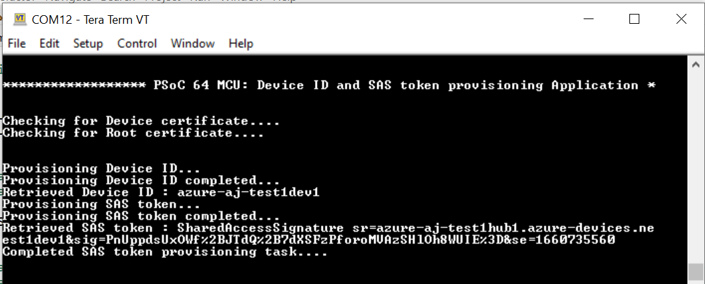
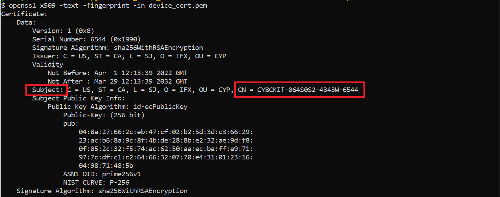
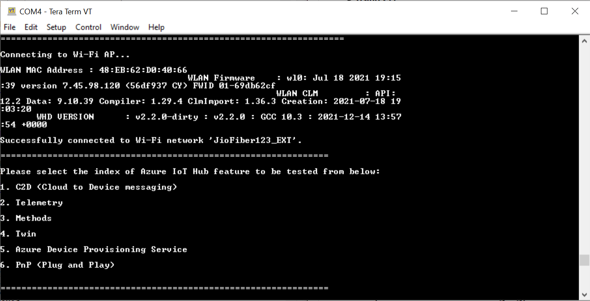
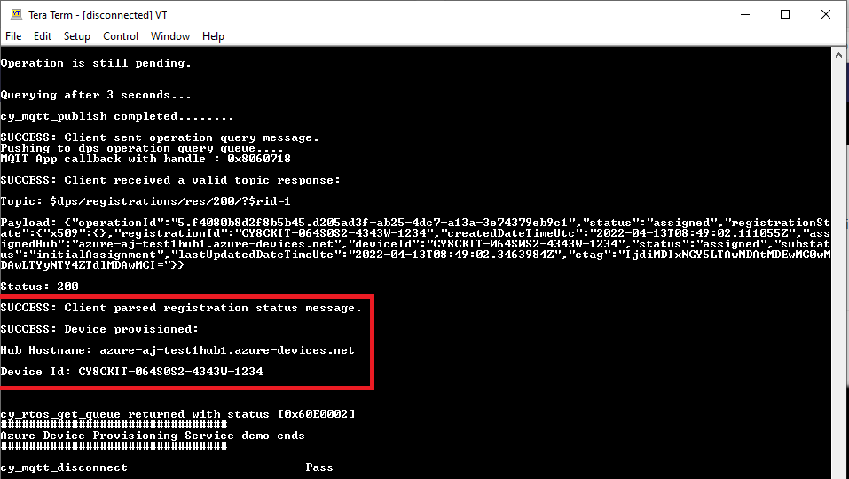
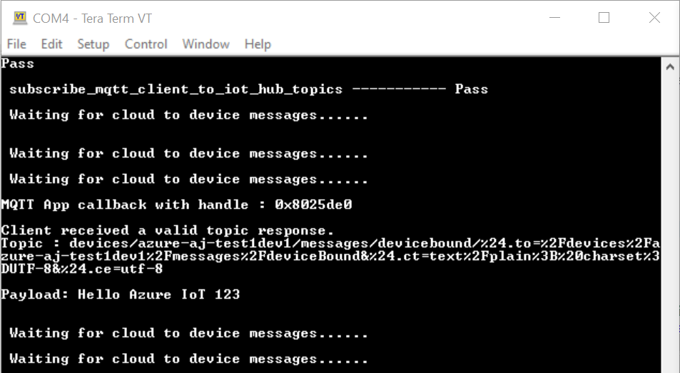
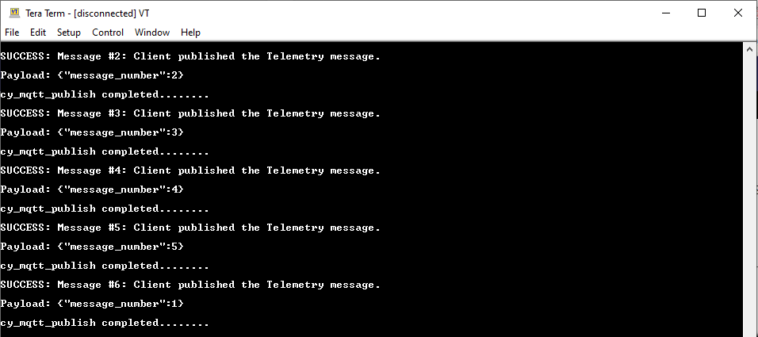
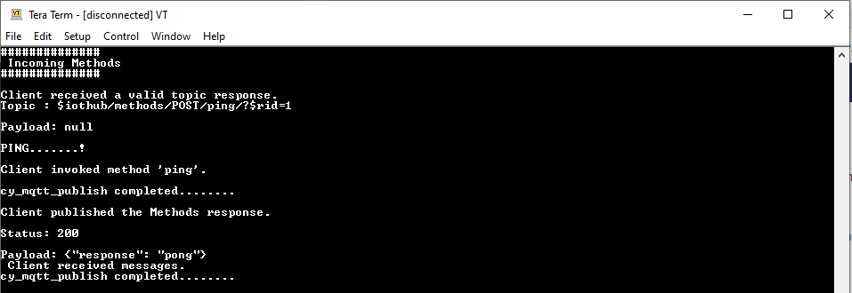
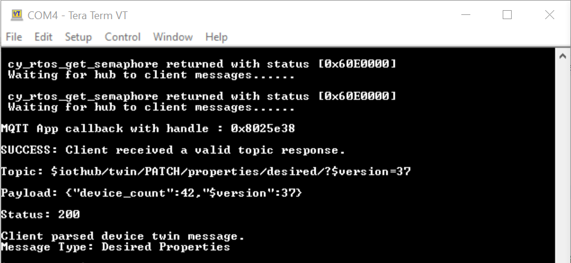

# Connecting to Azure IoT services using Azure SDK for Embedded C

This code example demonstrates connecting to the Azure IoT services using the Azure Software Development Kit (SDK) for Embedded C and Infineon's Wi-Fi connectivity SDK. This code example demonstrates features such as Internet of Things (IoT) Hub, Cloud to device (C2D), Telemetry, Methods, Device Twin, Azure Device Provisioning Service (DPS), and Plug and Play (PnP).

In this example, the [Azure C SDK port](https://github.com/Infineon/azure-c-sdk-port) is used with the [Mosquitto (MQTT)](https://github.com/Infineon/mqtt) library to connect to the Azure cloud. The IoT device authentication mode can either be X509 certificate-based or shared access signature (SAS)-based. During startup, the application provides a menu displaying features of the Azure IoT Hub service. Depending upon the use case selected, the message transmission takes place either from the cloud to the MCU device or vice versa.


[View this README on GitHub.](https://github.com/Infineon/mtb-example-azure-iot)

[Provide feedback on this code example.](https://cypress.co1.qualtrics.com/jfe/form/SV_1NTns53sK2yiljn?Q_EED=eyJVbmlxdWUgRG9jIElkIjoiQ0UyMzQwMTQiLCJTcGVjIE51bWJlciI6IjAwMi0zNDAxNCIsIkRvYyBUaXRsZSI6IkNvbm5lY3RpbmcgdG8gQXp1cmUgSW9UIHNlcnZpY2VzIHVzaW5nIEF6dXJlIFNESyBmb3IgRW1iZWRkZWQgQyIsInJpZCI6ImF5dXNoIGphaW4iLCJEb2MgdmVyc2lvbiI6IjQuMy4wIiwiRG9jIExhbmd1YWdlIjoiRW5nbGlzaCIsIkRvYyBEaXZpc2lvbiI6Ik1DRCIsIkRvYyBCVSI6IklDVyIsIkRvYyBGYW1pbHkiOiJQU09DIn0=)


## Requirements

- [ModusToolbox&trade;](https://www.infineon.com/modustoolbox) v3.1 or later (tested with v3.2)
- Board support package (BSP) minimum required version: 4.0.0
- Programming language: C
- Associated parts: All [PSoC&trade; 6 MCU](https://www.infineon.com/cms/en/product/microcontroller/32-bit-psoc-arm-cortex-microcontroller/psoc-6-32-bit-arm-cortex-m4-mcu) parts, [AIROC&trade; CYW43012 Wi-Fi & Bluetooth&reg; combo chip](https://www.infineon.com/cms/en/product/wireless-connectivity/airoc-wi-fi-plus-bluetooth-combos/wi-fi-4-802.11n/cyw43012), [AIROC&trade; CYW4343W Wi-Fi & Bluetooth&reg; combo chip](https://www.infineon.com/cms/en/product/wireless-connectivity/airoc-wi-fi-plus-bluetooth-combos/wi-fi-4-802.11n/cyw4343w), [AIROC&trade; CYW4373 Wi-Fi & Bluetooth&reg; combo chip](https://www.infineon.com/cms/en/product/wireless-connectivity/airoc-wi-fi-plus-bluetooth-combos/wi-fi-5-802.11ac/cyw4373), [AIROC&trade; CYW43439 Wi-Fi & Bluetooth&reg; combo chip](https://www.infineon.com/cms/en/product/wireless-connectivity/airoc-wi-fi-plus-bluetooth-combos/wi-fi-4-802.11n/cyw43439)
- Other tools: Python v3.8.10

## Supported toolchains (make variable 'TOOLCHAIN')

- GNU Arm&reg; Embedded Compiler v11.3.1 (`GCC_ARM`) – Default value of `TOOLCHAIN`
- Arm&reg; Compiler v6.16 (`ARM`)
- IAR C/C++ Compiler v9.30.1 (`IAR`)


## Supported kits (make variable 'TARGET')

- [PSoC&trade; 64 "Secure Boot" Wi-Fi Bluetooth&reg; Pioneer Kit](https://www.infineon.com/CY8CKIT-064B0S2-4343W) (`CY8CKIT-064B0S2-4343W`) – Default value of `TARGET`
- [PSoC&trade; 6 Wi-Fi Bluetooth&reg; Prototyping Kit](https://www.infineon.com/CY8CPROTO-062-4343W) (`CY8CPROTO-062-4343W`)
- [PSoC&trade; 6 Wi-Fi Bluetooth&reg; Pioneer Kit](https://www.infineon.com/CY8CKIT-062-WIFI-BT) (`CY8CKIT-062-WIFI-BT`)
- [PSoC&trade; 62S2 Wi-Fi Bluetooth&reg; Pioneer Kit](https://www.infineon.com/CY8CKIT-062S2-43012) (`CY8CKIT-062S2-43012`)
- [PSoC&trade; 62S2 Wi-Fi Bluetooth&reg; Prototyping Kit](https://www.infineon.com/CY8CPROTO-062S2-43439) (`CY8CPROTO-062S2-43439`)
- [PSoC&trade; 62S1 Wi-Fi Bluetooth&reg; Pioneer Kit](https://www.infineon.com/CYW9P62S1-43438EVB-01) (`CYW9P62S1-43438EVB-01`)
- [PSoC&trade; 62S1 Wi-Fi Bluetooth&reg; Pioneer Kit](https://www.infineon.com/CYW9P62S1-43012EVB-01) (`CYW9P62S1-43012EVB-01`)
- [PSoC&trade; 62S2 Evaluation Kit](https://www.infineon.com/CY8CEVAL-062S2) (`CY8CEVAL-062S2-LAI-4373M2`, `CY8CEVAL-062S2-MUR-43439M2`, `CY8CEVAL-062S2-LAI-43439M2`, `CY8CEVAL-062S2-MUR-4373EM2`)


## Hardware setup

This example uses the board's default configuration. See the kit user guide to ensure that the board is configured correctly.


## Software setup

See the [ModusToolbox&trade; tools package installation guide](https://www.infineon.com/ModusToolboxInstallguide) for information about installing and configuring the tools package.

1. Install a terminal emulator if you don't have one. Instructions in this document use [Tera Term](https://teratermproject.github.io/index-en.html).

2. Install the Python interpreter and add it to the top of the system path in environmental variables. This code example is tested with [Python v3.8.10](https://www.python.org/downloads/release/python-3810/).

3. Open a CLI terminal and run the following command to ensure the required modules are installed.

   ```
   pip install cysecuretools==4.2.0
   ```

This example requires the setup of Azure IoT Hub on the Microsoft Azure portal. Additionally, the visual studio code and its Azure IoT tool extension need to be set up with the created Azure Hub.

**Reference links**:

- [Azure Hub setup](https://docs.microsoft.com/en-us/azure/iot-hub/iot-hub-create-through-portal#create-an-iot-hub)

- [Visual Studio Code setup](https://code.visualstudio.com/download)

- [Azure IoT tools](https://marketplace.visualstudio.com/items?itemName=vsciot-vscode.azure-iot-toolkit)

- [Set Azure IoT Hub in VS code](https://devblogs.microsoft.com/iotdev/introducing-azure-iot-tools-for-visual-studio-code/#set-up-your-azure-iot-hub-in-vs-code)


## Using the code example


### Create the project

The ModusToolbox&trade; tools package provides the Project Creator as both a GUI tool and a command line tool.

<details><summary><b>Use Project Creator GUI</b></summary>

1. Open the Project Creator GUI tool.

   There are several ways to do this, including launching it from the dashboard or from inside the Eclipse IDE. For more details, see the [Project Creator user guide](https://www.infineon.com/ModusToolboxProjectCreator) (locally available at *{ModusToolbox&trade; install directory}/tools_{version}/project-creator/docs/project-creator.pdf*).

2. On the **Choose Board Support Package (BSP)** page, select a kit supported by this code example. See [Supported kits](#supported-kits-make-variable-target).

   > **Note:** To use this code example for a kit not listed here, you may need to update the source files. If the kit does not have the required resources, the application may not work.

3. On the **Select Application** page:

   a. Select the **Applications(s) Root Path** and the **Target IDE**.

   > **Note:** Depending on how you open the Project Creator tool, these fields may be pre-selected for you.

   b. Select this code example from the list by enabling its check box.

   > **Note:** You can narrow the list of displayed examples by typing in the filter box.

   c. (Optional) Change the suggested **New Application Name** and **New BSP Name**.

   d. Click **Create** to complete the application creation process.

</details>


<details><summary><b>Use Project Creator CLI</b></summary>

The 'project-creator-cli' tool can be used to create applications from a CLI terminal or from within batch files or shell scripts. This tool is available in the *{ModusToolbox&trade; install directory}/tools_{version}/project-creator/* directory.

Use a CLI terminal to invoke the 'project-creator-cli' tool. On Windows, use the command-line 'modus-shell' program provided in the ModusToolbox&trade; installation instead of a standard Windows command-line application. This shell provides access to all ModusToolbox&trade; tools. You can access it by typing "modus-shell" in the search box in the Windows menu. In Linux and macOS, you can use any terminal application.

The following example clones the "[Azure IoT](https://github.com/Infineon/mtb-example-azure-iot)" application with the desired name "AzureIoT" configured for the *CY8CKIT-064B0S2-4343W* BSP into the specified working directory, *C:/mtb_projects*:

   ```
   project-creator-cli --board-id CY8CKIT-064B0S2-4343W --app-id mtb-example-azure-iot --user-app-name AzureIoT --target-dir "C:/mtb_projects"
   ```


The 'project-creator-cli' tool has the following arguments:

Argument | Description | Required/optional
---------|-------------|-----------
`--board-id` | Defined in the <id> field of the [BSP](https://github.com/Infineon?q=bsp-manifest&type=&language=&sort=) manifest | Required
`--app-id`   | Defined in the <id> field of the [CE](https://github.com/Infineon?q=ce-manifest&type=&language=&sort=) manifest | Required
`--target-dir`| Specify the directory in which the application is to be created if you prefer not to use the default current working directory | Optional
`--user-app-name`| Specify the name of the application if you prefer to have a name other than the example's default name | Optional

<br>

> **Note:** The project-creator-cli tool uses the `git clone` and `make getlibs` commands to fetch the repository and import the required libraries. For details, see the "Project creator tools" section of the [ModusToolbox&trade; tools package user guide](https://www.infineon.com/ModusToolboxUserGuide) (locally available at {ModusToolbox&trade; install directory}/docs_{version}/mtb_user_guide.pdf).

</details>


### Open the project

After the project has been created, you can open it in your preferred development environment.

<details><summary><b>Eclipse IDE</b></summary>

If you opened the Project Creator tool from the included Eclipse IDE, the project will open in Eclipse automatically.

For more details, see the [Eclipse IDE for ModusToolbox&trade; user guide](https://www.infineon.com/MTBEclipseIDEUserGuide) (locally available at *{ModusToolbox&trade; install directory}/docs_{version}/mt_ide_user_guide.pdf*).

</details>


<details><summary><b>Visual Studio (VS) Code</b></summary>

Launch VS Code manually, and then open the generated *{project-name}.code-workspace* file located in the project directory.

For more details, see the [Visual Studio Code for ModusToolbox&trade; user guide](https://www.infineon.com/MTBVSCodeUserGuide) (locally available at *{ModusToolbox&trade; install directory}/docs_{version}/mt_vscode_user_guide.pdf*).

</details>


<details><summary><b>Keil µVision</b></summary>

Double-click the generated *{project-name}.cprj* file to launch the Keil µVision IDE.

For more details, see the [Keil µVision for ModusToolbox&trade; user guide](https://www.infineon.com/MTBuVisionUserGuide) (locally available at *{ModusToolbox&trade; install directory}/docs_{version}/mt_uvision_user_guide.pdf*).

</details>

<details><summary><b>IAR Embedded Workbench</b></summary>

Open IAR Embedded Workbench manually, and create a new project. Then select the generated *{project-name}.ipcf* file located in the project directory.

For more details, see the [IAR Embedded Workbench for ModusToolbox&trade; user guide](https://www.infineon.com/MTBIARUserGuide) (locally available at *{ModusToolbox&trade; install directory}/docs_{version}/mt_iar_user_guide.pdf*).

</details>

<details><summary><b>Command line</b></summary>

If you prefer to use the CLI, open the appropriate terminal, and navigate to the project directory. On Windows, use the command-line 'modus-shell' program; on Linux and macOS, you can use any terminal application. From there, you can run various `make` commands.

For more details, see the [ModusToolbox&trade; tools package user guide](https://www.infineon.com/ModusToolboxUserGuide) (locally available at *{ModusToolbox&trade; install directory}/docs_{version}/mtb_user_guide.pdf*).

</details>

## Authentication credentials setup

This section contains the steps to setup the X509 or SAS credentials-based on the hardware for the Azure IoT Hub.

<details><summary><b>Credentials setup for non-secured platform </b></summary>

For SAS-based authentication, the token generation steps are mentioned in the [Operation](#operation) section. <br>

For using X509-based certificate authentication, the steps are as follows:

   <details><summary><b>X509 certificate-based authentication mode</b></summary>

   Use the following steps to generate the device's X509 self-signed certificate and private key to setup the X509 authentication-based device on Azure IoT Hub.

   **Individual enrollments:**

   1. In the _< application >_ directory, create a _certificates_ directory.

   2. Run the following command in the modus-shell in the _certificates_ folder to generate the device private key.

      ```
      openssl req -newkey rsa:2048 -nodes -keyout dev_priv_key.pem
      ```

      To run this command, enter the additional information, as shown in the following example. The `Common Name` can be the user's choice but must match the _registration ID_ on the Azure DPS portal's enrollment or the _device ID_ on the Azure IoT Hub portal is created in the following steps:

      The `A challenge password` and `An optional company name` fields are left blank.

      ```
      Country Name (2 letter code) [XX]:US
      State or Province Name (full name) []:CA
      Locality Name (e.g, city) [Default City]:SJ
      Organization Name (e.g, company) [Default Company Ltd]:IFX
      Organizational Unit Name (e.g, section) []:INFINEON
      Common Name (e.g, your name or your server's hostname) []:azure_dps_dev_test1
      Email Address []:

      Please enter the following 'extra' attributes
      to be sent with your certificate request
      A challenge password []:
      An optional company name []:
      ```

   3. Copy the _x509_config.cfg_ file from the _scripts_ folder to the _certificates_ folder.

   4. Run the following command in the modus-shell in the _certificates_ directory to generate the X.509 certificate.

      > **Note**: The value of the common name field in the following command - `CN` can be the user's choice but must match the _registration ID_ on the Azure DPS portal's enrollment or the _device ID_ on the Azure IoT Hub portal is created as mentioned in the following steps:

      ```
      openssl req -new -days 1024 -nodes -x509 -key dev_priv_key.pem -out device_cert.pem -extensions client_auth -config x509_config.cfg -subj "/CN=azure_dps_dev_test1"
      ```

   5. Run the following command in the modus-shell in the _certificates_ directory to get the SHA thumbprint of the device certificate created in **Step 4**. Copy the fingerprint generated in the following command.

      ```
      openssl x509 -noout -fingerprint -in device_cert.pem | sed 's/://g'| sed 's/\(SHA1 Fingerprint=\)//g'
      ```

      Example of a fingerprint from the previous command:

      ```
      902E7A49F252A49D0AB30AB1D2FBEAE702495F2F
      ```

   6. For **Azure DPS flow** - To create **Individual Enrollment** in the Azure DPS portal, see [X509 DPS device enrollment](https://learn.microsoft.com/en-us/azure/iot-dps/quick-create-simulated-device-x509?tabs=windows&pivots=programming-language-ansi-c#create-a-device-enrollment). Select the X509 mode of authentication and upload the device_cert.pem in both _Primary Certificate_ and _Secondary Certificate_ fields and then _save_. The _registration ID_ of the created enrollment appears the same as the `CN` used in **Step 5**.

      For **without Azure DPS flow** - In the Azure portal, see [Azure device setup](https://docs.microsoft.com/en-us/azure/iot-hub/iot-hub-create-through-portal#register-a-new-device-in-the-iot-hub) and create the Azure IoT device using the _X509 self-signed option_. Paste the same fingerprint copied in **Step 6** in both "primary" and "secondary" thumbprints. The _device name_ should be the same as the `Common Name` used in **Step 1** of this section where the root certificate is created. <br>

   7. Download [Baltimore CyberTrust Root certificate](https://docs.microsoft.com/en-us/azure/security/fundamentals/tls-certificate-changes) and place it in the _certificates_ folder then run the below command to convert the certificate from `.crt` to `.pem`. The `out` parameter must be `azure_rootCA.pem`.

      ```
      openssl x509 -inform der -in BaltimoreCyberTrustRoot.crt -out azure_rootCA.pem
      ```

      > **Note:** If the Azure IoT Hub is configured to use the DigiCert Global G2 Root certificate, use the same here.

   8. In _source/mqtt_main.h_, set `azure_root_ca_certificate` to the _azure_RootCA.pem_ and set `azure_client_cert` and `azure_client_key` to the device certificate and device key respectively. The pem format of the certificates and keys needs to be used in the file. Use _scripts/format_X509_cert_key.py_ to generate the formatted pem to be used in _source/mqtt_main.h_.
   Copy and paste this script in the _certificates_ folder and use it as follows:

      ```
      python format_X509_cert_key.py azure_rootCA.pem device_cert.pem dev_priv_key.pem
      ```

   **Enrollment groups:**

   1. In the < application > directory, create a _certificates_ directory. From the modus-shell, navigate to the _certificates_ folder.

   2. Create a root CA certificate, intermediate CA certificate, and a device certificate by following the instructions from [Tutorial: Provision multiple X.509 devices using enrollment groups](https://learn.microsoft.com/en-us/azure/iot-dps/tutorial-custom-hsm-enrollment-group-x509#set-up-the-x509-openssl-environment).

   3. Download [Baltimore CyberTrust Root certificate](https://docs.microsoft.com/en-us/azure/security/fundamentals/tls-certificate-changes), place it in the _certificates_ folder, and then run the following command to convert the certificate from `.crt` to `.pem`. The `out` parameter must be `azure_rootCA.pem`.

      ```
      openssl x509 -inform der -in BaltimoreCyberTrustRoot.crt -out azure_rootCA.pem
      ```

   4. In _source/mqtt_main.h_, set `azure_root_ca_certificate` to the _azure_RootCA.pem_, and set `azure_client_cert` and `azure_client_key` to the device certificate chain and device key respectively. Use the pem format of the certificates and keys in the file.

      For `azure_client_cert`, add the whole certificate chain containing root CA, intermediate CA, and the device certificate in the following format:

      ```
      -----BEGIN CERTIFICATE-----
      <Text for the device certificate includes public key>
      -----END CERTIFICATE-----
      -----BEGIN CERTIFICATE-----
      <Text for the intermediate certificate includes public key>
      -----END CERTIFICATE-----
      -----BEGIN CERTIFICATE-----
      <Text for the root certificate includes public key>
      -----END CERTIFICATE-----
      ```

   5. For **Azure DPS flow** - To create **Enrollment group** in the Azure DPS portal, see [X509 DPS Enrollment groups](https://learn.microsoft.com/en-us/azure/iot-dps/tutorial-custom-hsm-enrollment-group-x509#create-an-enrollment-group). Select the X509 mode of authentication and upload the intermediate certificate in both _Primary Certificate_ and _Secondary Certificate_ fields and then _save_.

   6. Add the root CA certificate to DPS and verify the ownership. See [Verify ownership of the root certificate](https://learn.microsoft.com/en-us/azure/iot-dps/tutorial-custom-hsm-enrollment-group-x509#verify-ownership-of-the-root-certificate).

   </details>

</details>

<details><summary><b>Credentials setup for a secured platform (CY8CKIT-064B0S2-4343W)</b></summary>

_CY8CKIT-064B0S2-4343W_ requires provisioning of _keys_ and _policies_ into the hardware, the following sections describe the steps for the same. These secure keys and policies are used during the _secure boot flow_. For more information on _secure boot sdk_, see the [PSoC&trade; 64 MCU "Secure Boot" user guide](https://www.infineon.com/dgdlac/Infineon-PSoC_64_Secure_MCU_Secure_Boot_SDK_User_Guide-Software-v07_00-EN.pdf?fileId=8ac78c8c7d0d8da4017d0f8c361a7666&utm_source=cypress&utm_medium=referral&utm_campaign=202110_globe_en_all_integration-software).

   <details><summary><b>Shared access signature (SAS)-based authentication mode</b></summary>

   This section describes the provisioning steps for this example and the setup of SAS tokens into the secure hardware, these will be used for a secure socket connection with the Azure cloud.

   Before generating the SAS tokens the kit needs to be provisioned with keys and policies using the following steps:

   > **Note:** The KitProg3 must be in DAPLink mode for performing this section. Press the 'MODE SELECT' button on the kit until the Status LED blinks fast. Also, ensure the J26 jumper is open.

   1. In modus-shell, navigate to the folder _< application >/imports/trusted-firmware-m/security/COMPONENT_CY8CKIT-064B0S2-4343W_. The imports folder will be created during the library manager update of the Trusted Firmware-M asset and the library manager update takes place as mentioned in [Using the code example](#using-the-code-example) section.

   2. Run the following command.

      ```
      cysecuretools --target CY8CKIT-064B0S2-4343W init
      ```

   3. Run the following commands in the modus-shell from _< application >/imports/trusted-firmware-m/security/COMPONENT_CY8CKIT-064B0S2-4343W_ directory. Select `n` if prompted for overwriting _keys_ folder.

      > **Note:** If the kit is already provisioned, skip to the next step.

      ```
      cysecuretools -t CY8CKIT-064B0S2-4343W -p policy/policy_single_CM0_CM4_smif_swap.json create-keys
      cysecuretools -t CY8CKIT-064B0S2-4343W -p policy/policy_single_CM0_CM4_smif_swap.json provision-device
      ```

   4. Create a folder called _certificates_ and then navigate into the _certificates_ folder in modus-shell.

   5. Run the following commands in the modus-shell to generate the root certificate and root key:

      ```
      openssl genrsa -out rootCA.key 2048
      ```

      ```
      openssl req -x509 -new -nodes -key rootCA.key -sha256 -days 1024 -out rootCA.pem
      ```

      When you run this command, enter an additional information as follows and leave the `Common Name` and `Email Address` fields empty.

      ```
      Country Name (2 letter code) [XX]:US
      State or Province Name (full name) []:CA
      Locality Name (e.g, city) [Default City]:SJ
      Organization Name (e.g, company) [Default Company Ltd]:IFX
      Organizational Unit Name (e.g, section) []:INFINEON
      Common Name (e.g, your name or your server's hostname) []:
      Email Address []:
      ```

   6. Download [Baltimore CyberTrust Root certificate](https://docs.microsoft.com/en-us/azure/security/fundamentals/tls-certificate-changes) and place it in the _certificates_ folder and then run the following command to convert the certificate from `.crt` to `.pem`. The `out` parameter must be `azure_rootCA.pem`.

      ```
      openssl x509 -inform der -in BaltimoreCyberTrustRoot.crt -out azure_rootCA.pem
      ```

      > **Note:** If the Azure IoT Hub is configured to use the DigiCert Global G2 Root certificate, use the same here.

   7. Inside the _< application >/imports/trusted-firmware-m/security/COMPONENT_CY8CKIT-064B0S2-4343W/policy_ folder, edit the "provisioning" section of the _policy_multi_CM0_CM4_tfm_dev_certs.json_ policy as follows and then _save_ and _close_ this policy file.

      ```
      "provisioning":
      {
         "packet_dir": "../packets",
         "chain_of_trust": ["../certificates/device_cert.pem", "../certificates/azure_rootCA.pem"]
      },
      ```

   8. Copy the script _reprov_helper.py_ from the folder _< application >/imports/trusted-firmware-m/security_ to the folder _< application >/imports/trusted-firmware-m/security/COMPONENT_CY8CKIT-064B0S2-4343W_.

   9. It will generate the _device certificate_, and provision the _device certificate_ and _azure_RootCA_ into the hardware.

      Run the following command in the modus-shell in the _< application >/imports/trusted-firmware-m/security/COMPONENT_CY8CKIT-064B0S2-4343W_ directory to create the device certificate and keys, and provision them in the hardware. When prompted, enter a device serial number of your choice, `1234`. Select `N` when asked to create new keys and allow for reprovisioning by selecting `y`.

      ```
      python reprov_helper.py -p policy/policy_multi_CM0_CM4_tfm_dev_certs.json -d cy8ckit-064b0s2-4343w
      ```

   10. On the kit, press the 'MODE SELECT' button again until the KitProg3 status LED stops blinking and place the J26 jumper back.

   For SAS mode, store a valid _device ID_ and corresponding _SAS token_ in the secured element through the following steps.

   1. Create an Azure IoT Device or **Individual enrollment** as mentioned in **Step 3** of the [Operation](#operation) section.

   2. For **Azure DPS flow**

      Update the file _source/mqtt_iot_sas_token_provision.c_ as follows:
      - Update the registration ID in the `AZURE_CLIENT_DEVICE_ID` macro.
      - Update the SAS token in the `AZURE_CLIENT_SAS_TOKEN` macro. <br>

      For **without Azure DPS flow**

      Update the file _source/mqtt_iot_sas_token_provision.c_ as follows:
      - Update the device ID in the `AZURE_CLIENT_DEVICE_ID` macro.
      - Update the SAS token in the `AZURE_CLIENT_SAS_TOKEN` macro.

   3. Run the application _source/mqtt_iot_sas_token_provision.c_ to store the device ID and SAS token in the secured element. To build the _source/mqtt_iot_sas_token_provision.c_ application:

      Uncomment the following line in the _Makefile_ to disable the build of the _source/main.c_ file.

      `#CY_IGNORE += ./source/main.c`

      Comment the following line to enable the build of _source/mqtt_iot_sas_token_provision.c_.

      `CY_IGNORE += ./source/mqtt_iot_sas_token_provision.c`

      Perform clean, build, and finally program the application in a similar way as in [Using the code example](#using-the-code-example) section. On successful provisioning, a message appears as shown in **Figure 1**.

      **Figure 1. SAS token provision success**

      

      After successful provisioning of the SAS token into the hardware, enable _source/main.c_ and disable _source/mqtt_iot_sas_token_provision.c_ by editing the lines in the _Makefile_ as follows:

      ```
      #CY_IGNORE += ./source/main.c
      CY_IGNORE += ./source/mqtt_iot_sas_token_provision.c
      ```
      > **Note**: For SAS-based authentication mode, the application should pass an `azure_root_ca_certificate`, `azure_client_cert`, and `azure_client_key` values as `NULL` in the _source/mqtt_main.h_ file.

   </details>

   <details><summary><b>X509 certificate-based authentication mode</b></summary>

   This section describes the provisioning steps for this example and the setup of X.509 certificates into the secure hardware, which will be used for secure socket connection with the Azure cloud.

   > **Note:** The KitProg3 must be in DAPLink mode for performing this section. Press the 'MODE SELECT' button on the kit until the status LED blinks fast. Ensure that the J26 jumper is open.

   1. In modus-shell, navigate to the folder _< application >/imports/trusted-firmware-m/security/COMPONENT_CY8CKIT-064B0S2-4343W_. The imports folder will be created during the library manager update of the Trusted Firmware-M asset and the library manager update takes place as mentioned in [Using the code example](#using-the-code-example) section.

   2. Run the following command.

      ```
      cysecuretools --target CY8CKIT-064B0S2-4343W init
      ```

   3. Run the following commands in the modus-shell from _< application >/imports/trusted-firmware-m/security/COMPONENT_CY8CKIT-064B0S2-4343W_ directory. Select `n` if prompted for overwriting _keys_ folder.

      > **Note:** If the kit is already provisioned, skip to the next step.

      ```
      cysecuretools -t CY8CKIT-064B0S2-4343W -p policy/policy_multi_CM0_CM4_tfm_dev_certs.json create-keys
      ```

   4. Create a folder called _certificates_ and then navigate into the _certificates_ folder in modus-shell.

   5. Run the following commands in the modus-shell to generate the root certificate and root key:

      ```
      openssl genrsa -out rootCA.key 2048
      ```

      ```
      openssl req -x509 -new -nodes -key rootCA.key -sha256 -days 1024 -out rootCA.pem
      ```

      When you run this command, you need to enter additional information, as shown below. Leave the `Common Name` and `Email Address` fields empty.

      ```
      Country Name (2 letter code) [XX]:US
      State or Province Name (full name) []:CA
      Locality Name (e.g, city) [Default City]:SJ
      Organization Name (e.g, company) [Default Company Ltd]:IFX
      Organizational Unit Name (e.g, section) []:INFINEON
      Common Name (e.g, your name or your server's hostname) []:
      Email Address []:
      ```

   6. Download [Baltimore CyberTrust Root certificate](https://docs.microsoft.com/en-us/azure/security/fundamentals/tls-certificate-changes) and place it in the _certificates_ folder then run the below command to convert the certificate from `.crt` to `.pem`. The `out` parameter must be `azure_rootCA.pem`.

      ```
      openssl x509 -inform der -in BaltimoreCyberTrustRoot.crt -out azure_rootCA.pem
      ```

      > **Note:** If the Azure IoT device is configured to use the DigiCert Global G2 Root certificate, use the same here.

   7. Inside the _< application >/imports/trusted-firmware-m/security/COMPONENT_CY8CKIT-064B0S2-4343W/policy_ folder, edit the "provisioning" section of the _policy_multi_CM0_CM4_tfm_dev_certs.json_ policy as shown below and then save and close this policy file.

      ```
      "provisioning":
      {
         "packet_dir": "../packets",
         "chain_of_trust": ["../certificates/device_cert.pem", "../certificates/azure_rootCA.pem"]
      },
      ```

   8. Copy the script _reprov_helper.py_ from the folder _< application >/imports/trusted-firmware-m/security_ to the folder _< application >/imports/trusted-firmware-m/security/COMPONENT_CY8CKIT-064B0S2-4343W_.

   9. This step will generate the _device certificate_ and provision the _device certificate_ & _azure_RootCA_ into the hardware.

      Run the following command in the modus-shell in the _< application >/imports/trusted-firmware-m/security/COMPONENT_CY8CKIT-064B0S2-4343W_ directory to create the device certificate and keys, and then provision them in the hardware. When prompted, enter a device serial number of your choice, `1234`. Select `N` when asked to create new keys and allow for reprovisioning by selecting `y`.

      ```
      python reprov_helper.py -p policy/policy_multi_CM0_CM4_tfm_dev_certs.json -d cy8ckit-064b0s2-4343w
      ```

   10. On the kit, press the 'MODE SELECT' button again until the KitProg3 status LED stops blinking and place the J26 jumper back.

   11. Run the following command in the modus-shell in the _< application >/imports/trusted-firmware-m/security/COMPONENT_CY8CKIT-064B0S2-4343W/certificates_ directory to get the SHA thumbprint of the device certificate created in **Step 10**. Copy the fingerprint generated in the below command.

         Example for a fingerprint:

         ```
         openssl x509 -noout -fingerprint -in device_cert.pem | sed 's/://g'| sed 's/\(SHA1 Fingerprint=\)//g'
         ```

         ```
         902E7A49F252A49D0AB30AB1D2FBEAE702495F2F
         ```

   12. The `Subject` `CN` from the device certificate might be used in further steps. Use the below command on the generated device certificate to note the same.

         ```
         openssl x509 -text -fingerprint -in device_cert.pem
         ```

         A sample CN is shown in **Figure 2**.

         **Figure 2. Example subject common name**

         

   13. For **Azure DPS flow** - Create an **Individual Enrollment** in the Azure DPS portal by referring to [X509 DPS device enrollment](https://learn.microsoft.com/en-us/azure/iot-dps/quick-create-simulated-device-x509?tabs=windows&pivots=programming-language-ansi-c#create-a-device-enrollment). Select the X509 mode of authentication and upload the device_cert.pem in both **primary** and **secondary** certificate fields and then save. The registration ID of the created enrollment will appear the same as the `Subject` `CN` as noted in the previous steps.

         For **without Azure DPS flow** - In the Azure portal, see [Azure device setup](https://docs.microsoft.com/en-us/azure/iot-hub/iot-hub-create-through-portal#register-a-new-device-in-the-iot-hub) and create the Azure IoT device using the _X509 self-signed option_. Paste the same fingerprint copied in the previous step in both **primary** and **secondary** thumbprints. The device name should be the same as the `Subject` `CN` as noted in the previous steps.

         > **Note**: Do not pass any certificates or keys from the application. While establishing a connection with the Azure broker, certificates and keys stored in the secured memory are used.

   </details>

</details>

## Operation

1. Connect the board to your PC using the provided USB cable through the KitProg3 USB connector.

2. Select from either of the following methods for authentication of the Azure IoT device with the Azure Hub.

      <details><summary><b>Shared access signature (SAS)-based authentication mode </b></summary>

      1. Set the `SAS_TOKEN_AUTH` macro to `1` in _source/azure_common.h_.

      2. Update the files as follows:

         <details><summary><b> Non-secure hardware </b></summary>

         For non-secure hardware platforms like _CY8CPROTO-062-4343W_, the SAS token can be used in the following ways. Select from either of the following methods as per the use case.

         <details><summary><b>Azure Device Provisioning Service (DPS)</b></summary>

            The following steps are used to generate the output of **Azure Device Provisioning Service** menu option of this ModusToolbox&trade; application.
            Upon completing the following steps, the status of the provisioning is shown in **Figure 8**.

            1. Create a **DPS** and an **Individual Enrollment** by referring to the [Quick DPS setup](https://docs.microsoft.com/en-us/azure/iot-dps/quick-setup-auto-provision?view=iotedge-2020-11) and [SAS DPS device enrollment](https://docs.microsoft.com/en-us/azure/iot-dps/quick-create-simulated-device-symm-key?pivots=programming-language-ansi-c#create-a-device-enrollment). Do not specify the device ID while doing the same as the registration ID will be used as the device ID in the further steps.

            2. Update valid `Scope ID`, `Registration ID`, and `Provisioning SAS Key` (Primary Key) values in _scripts/dps_sas_token_generation.py_. Run the script after updating it, note the generated SAS token.

               > **Note:** The value of the `Scope ID` can be noted from the created Azure DPS portal. In addition, the `Registration ID`, and `Provisioning SAS Key` can be noted from the created **Individual Enrollment** portal.

            3. In _source/azure_common.h_, set the `SAS_TOKEN_LOCATION_FLASH` macro as `true`.

            4. In _source/mqtt_main.h_ update the following macros:
               - Update the above generated SAS token in `IOT_AZURE_PASSWORD`
               - Update the DPS registration ID in `IOT_AZURE_DPS_REGISTRATION_ID`
               - Update the ID scope value in `IOT_AZURE_ID_SCOPE`

         </details>

         **OR**

         <details><summary><b>Without Azure Device Provisioning Service (DPS)</b></summary>

         The following steps are used to generate the output of the **Azure Device App (C2D, Telemetry, Methods, Device Twin)** and **PnP (Plug and Play)** menu options of this ModusToolbox&trade; application.

         1. Create a SAS authentication-based device on the Azure IoT Hub by referring to [Azure device setup](https://docs.microsoft.com/en-us/azure/iot-hub/iot-hub-create-through-portal#register-a-new-device-in-the-iot-hub).

         2. Generate a SAS token for the device using the following instructions as mentioned in [SAS token generation](https://github.com/Microsoft/vscode-azure-iot-toolkit/wiki/Generate-SAS-Token-for-Device). The VS Code's [Get device info](https://github.com/Microsoft/vscode-azure-iot-toolkit/wiki/Get-Device-Info) can be used for acquiring device information like the host name and device ID.

         3. In _source/azure_common.h_, set the `SAS_TOKEN_LOCATION_FLASH` macro as `true`.

         4. In _source/mqtt_main.h_ update the following macros:
            - Update the device ID in `MQTT_CLIENT_IDENTIFIER_AZURE_SAS`
            - Update host name/hub name of the created IoT Hub in `IOT_DEMO_SERVER_AZURE`
            - Update the generated SAS token in `IOT_AZURE_PASSWORD`

         </details>

         </details>

         <details><summary><b> Secure hardware </b></summary>

         For secure hardware platforms like _CY8CKIT-064B0S2-4343W_, the SAS token can be used in the following ways. Select from either of the following methods as per the use case.

            <details><summary><b>Azure Device Provisioning Service (DPS)</b></summary>

            The following steps are used to generate the output of **Azure Device Provisioning Service** menu option of this ModusToolbox&trade; application.
            Upon completing the following steps, the status of the provisioning is shown in **Figure 8**.

            1. Create a **DPS** and an **Individual Enrollment** by referring to the [Quick DPS setup](https://docs.microsoft.com/en-us/azure/iot-dps/quick-setup-auto-provision?view=iotedge-2020-11) and [SAS DPS device enrollment](https://docs.microsoft.com/en-us/azure/iot-dps/quick-create-simulated-device-symm-key?pivots=programming-language-ansi-c#create-a-device-enrollment). Do not specify the device ID while doing the same as the registration ID will be used as the device ID in the further steps.

            2. Update valid `Scope ID`, `Registration ID`, and `Provisioning SAS Key` ( _Primary Key_ ) values in _scripts/dps_sas_token_generation.py_. Run the script after updating it, note the generated SAS token.

            > **Note:** The value of the `Scope ID` can be noted from the created Azure DPS portal. In addition, the `Registration ID`, and `Provisioning SAS Key` can be noted from the created **Individual Enrollment** portal.

            3. Provision the registration ID and generated SAS token by following the steps in [Authentication credentials setup](#authentication-credentials-setup) for the secure hardware.

            4. In _source/azure_common.h_, set the `SAS_TOKEN_LOCATION_FLASH` macro as `false` to enable reading of the device ID and SAS token from the secured element.

            5. In _source/mqtt_main.h_, update the following macros:
               - Update the DPS registration ID in the `IOT_AZURE_DPS_REGISTRATION_ID` macro
               - Update the ID scope value in the `IOT_AZURE_ID_SCOPE` macro

            </details>

            **OR**

            <details><summary><b>Without Azure Device Provisioning Service (DPS)</b></summary>

            The following steps are used to generate the output of the **Azure Device App (C2D, Telemetry, Methods, Device Twin)** and **PnP (Plug and Play)** menu options of this ModusToolbox&trade; application.

            1. Create a SAS authentication-based device on Azure IoT Hub by referring to [Azure device setup](https://docs.microsoft.com/en-us/azure/iot-hub/iot-hub-create-through-portal#register-a-new-device-in-the-iot-hub).

            2. Generate a SAS token for the device by following the instructions in [SAS token generation](https://github.com/Microsoft/vscode-azure-iot-toolkit/wiki/Generate-SAS-Token-for-Device). The VS Code's [Get device info](https://github.com/Microsoft/vscode-azure-iot-toolkit/wiki/Get-Device-Info) can be used for acquiring device information like the host name and the device ID.

            3. In _source/azure_common.h_, set the `SAS_TOKEN_LOCATION_FLASH` macro as `false` to enable reading of the device ID and SAS token from the secured element.

            4. In _source/mqtt_main.h_, update the host name/hub name of the created IoT Hub in `IOT_DEMO_SERVER_AZURE`.

            5. Provision the _device ID_ and the _SAS token_ using the steps in [Authentication credentials setup](#authentication-credentials-setup) for secure hardware.

            </details>

         </details>

      </details>

      <details><summary><b>X509 certificate-based authentication mode</b></summary>

      1. Set the `SAS_TOKEN_AUTH` macro to `0` and `SAS_TOKEN_LOCATION_FLASH` to `false` in _source/azure_common.h_.

      2. Update the files as follows:

         <details><summary><b> Non-secure hardware </b></summary>

            <details><summary><b>Azure Device Provisioning Service (DPS)</b></summary>

            The following steps are used to generate the output of **Azure Device Provisioning Service** menu option of this ModusToolbox&trade; application.
            Upon completing the following steps, the status of the provisioning is shown in **Figure 8**.

            1. Create a DPS by referring to the [Quick DPS setup](https://docs.microsoft.com/en-us/azure/iot-dps/quick-setup-auto-provision?view=iotedge-2020-11).

            2. See the [Authentication credentials setup](#authentication-credentials-setup) for creating X.509 certificates and **Individual Enrollment** for Azure DPS.

            3. In the _source/mqtt_main.h_ file, update the following macros:

               - Update the DPS registration ID in the `MQTT_CLIENT_IDENTIFIER_AZURE_CERT` macro.
               - Update the host name/hub name (if known beforehand) on which the device will be registered in the `IOT_DEMO_SERVER_AZURE` macro.
               > **Note:** After successful run of the DPS feature, the terminal logs will mention the host name/hub name on which the device will be registered, the same can also be updated in the macro and the kit reprogrammed with the same.
               - Update the DPS registration ID in the `IOT_AZURE_DPS_REGISTRATION_ID` macro.
               - Update the ID scope value in the `IOT_AZURE_ID_SCOPE` macro.
               - Update the pem format value of certificates and keys in the `azure_root_ca_certificate`, `azure_client_cert`, and `azure_client_key` as mentioned in the [Authentication credentials setup](#authentication-credentials-setup) section for non-secure kit.

               > **Note:** The value of the `Scope ID` can be noted from the created Azure DPS portal. In addition, the `Registration ID`, and `Provisioning SAS Key` can be noted from the created **Individual Enrollment** portal.

            </details>

            **OR**

            <details><summary><b>Without Azure Device Provisioning Service (DPS)</b></summary>

            The following steps are used to generate the output of the **Azure Device App (C2D, Telemetry, Methods, Device Twin)** and **PnP (Plug and Play)** menu options of this ModusToolbox&trade; application.
            Upon completing the following steps, the status of the provisioning is as shown in **Figure 8**.

            1. Create an X509-based device, it is a certificate and private key for Azure IoT Hub by referring to [Authentication credentials setup](#authentication-credentials-setup).

            2. In _source/mqtt_main.h_ update the following macros:

               - Update the device ID in the `MQTT_CLIENT_IDENTIFIER_AZURE_CERT` macro.
               - Update the host name/hub name on which the device will be registered in the `IOT_DEMO_SERVER_AZURE` macro.
               - Update the pem format value of certificates and keys in the `azure_root_ca_certificate`, `azure_client_cert`, and `azure_client_key` as mentioned in the [Authentication credentials setup](#authentication-credentials-setup) section for a non-secure kit.

            </details>

         </details>

         <details><summary><b>Secure hardware</b></summary>

           <details><summary><b>Azure Device Provisioning Service (DPS)</b></summary>

            The following steps are used to generate the output of **Azure Device Provisioning Service** menu option of this ModusToolbox&trade; application.
            Upon completing the following steps, the status of the provisioning is shown in **Figure 8**.

            1. Create a **DPS** by referring to the [Quick DPS setup](https://docs.microsoft.com/en-us/azure/iot-dps/quick-setup-auto-provision?view=iotedge-2020-11).

            2. See [Authentication credentials setup](#authentication-credentials-setup) for creating X.509 certificates and **Individual Enrollment** for Azure DPS. Certificates will be read from the secured memory during a TLS connection with Azure.

            3. In _source/mqtt_main.h_, update the following macros:
               - Update the DPS registration ID in the `MQTT_CLIENT_IDENTIFIER_AZURE_CERT` macro
               - Update the host name/hub name (if known beforehand) on which the device will be registered in the `IOT_DEMO_SERVER_AZURE` macro.<br>
               > **Note:** After successful run of the DPS feature, the terminal logs will mention the host name/hub name on which the device will be registered, the same can also be updated in the macro and the kit reprogrammed with the same.<br>
               - Update the DPS registration ID in the `IOT_AZURE_DPS_REGISTRATION_ID` macro
               - Update the ID scope value in the `IOT_AZURE_ID_SCOPE` macro

               > **Note:** The value of the `Scope ID` can be noted from the created Azure DPS portal. In addition, the `Registration ID`, and `Provisioning SAS Key` can be noted from the created **Individual Enrollment** portal.

            In _CY8CKIT-064B0S2-4343W_ kit example, [FreeRTOS PSA PKCS11](https://github.com/Linaro/freertos-pkcs11-psa/) implementation supports only SHA-256 hashing algorithm. So the application should choose the cipher suite list compatible with the SHA-256. To choose the cipher suite list, the application needs to add the required cipher suites to the `MBEDTLS_SSL_CIPHERSUITES` macro in _configs/mbedtls_user_config.h_ file. The sample _configs/mbedtls_user_config.h_ file includes `MBEDTLS_TLS_ECDHE_RSA_WITH_AES_128_GCM_SHA256` and `MBEDTLS_TLS_ECDHE_RSA_WITH_AES_128_CBC_SHA256` cipher suites to communicate with the Azure broker.

            ```
            #define MBEDTLS_SSL_CIPHERSUITES MBEDTLS_TLS_ECDHE_RSA_WITH_AES_128_GCM_SHA256,\
                                             MBEDTLS_TLS_ECDHE_RSA_WITH_AES_128_CBC_SHA256
            ```

            > **Note**: See the list of supported cipher suites [Azure Hub](https://docs.microsoft.com/en-us/azure/iot-hub/iot-hub-tls-support#cipher-suites) and [Azure DPS](https://docs.microsoft.com/en-us/azure/iot-dps/tls-support#recommended-ciphers) before adding cipher suites to the `MBEDTLS_SSL_CIPHERSUITES`.

            </details>

            **OR**

            <details><summary><b>Without Azure Device Provisioning Service (DPS)</b></summary>

            The following steps are used to generate the output of the **Azure Device App (C2D, Telemetry, Methods, Device Twin)** and **PnP (Plug and Play)** menu options of this ModusToolbox&trade; application.
            Upon completing the following steps, the status of the provisioning is shown in **Figure 8**.

            1. Create an X509-based device, it is a certificate and private key for the Azure IoT Hub by referring to [Authentication credentials setup](#authentication-credentials-setup).

            2. In source/mqtt_main.h update the following macros:
               - Update the device ID in the `MQTT_CLIENT_IDENTIFIER_AZURE_CERT` macro.
               - Update the host name/hub name of the created IoT Hub in the `IOT_DEMO_SERVER_AZURE` macro.

            The certificates and keys must be generated and provisioned as mentioned in the [Authentication credentials setup](#authentication-credentials-setup) section for the secure kit. Certificates and keys will be read from the secured memory during a TLS connection.

            In _CY8CKIT-064B0S2-4343W_ kit example, [FreeRTOS PSA PKCS11](https://github.com/Linaro/freertos-pkcs11-psa/) implementation supports only SHA-256 hashing algorithm. So the application should choose the cipher suite list compatible with the SHA-256. To choose the cipher suite list, the application needs to add the required cipher suites to the `MBEDTLS_SSL_CIPHERSUITES` macro in _configs/mbedtls_user_config.h_ file. The sample _configs/mbedtls_user_config.h_ file includes `MBEDTLS_TLS_ECDHE_RSA_WITH_AES_128_GCM_SHA256` and `MBEDTLS_TLS_ECDHE_RSA_WITH_AES_128_CBC_SHA256` cipher suites to communicate with the Azure broker.

            ```
            #define MBEDTLS_SSL_CIPHERSUITES MBEDTLS_TLS_ECDHE_RSA_WITH_AES_128_GCM_SHA256,\
                                             MBEDTLS_TLS_ECDHE_RSA_WITH_AES_128_CBC_SHA256
            ```

            > **Note:** See the list of supported cipher suites [Azure Hub](https://docs.microsoft.com/en-us/azure/iot-hub/iot-hub-tls-support#cipher-suites) and [Azure DPS](https://docs.microsoft.com/en-us/azure/iot-dps/tls-support#recommended-ciphers) before adding cipher suites to the `MBEDTLS_SSL_CIPHERSUITES`.

            </details>

         </details>

      </details>


4. Update the Wi-Fi details `WIFI_SSID` and `WIFI_PASSWORD` in the _source/mqtt_main.h_ file.

5. Open a terminal program and select the KitProg3 COM port. Set the serial port parameters to 8N1 and 115200 baud.

6. Program the board using one of the following:

   <details><summary><b>Using Eclipse IDE</b></summary>

      1. Select the application project in the Project Explorer.

      2. In the **Quick Panel**, scroll down, and click **\<Application Name> Program (KitProg3_MiniProg4)**.
   </details>


   <details><summary><b>In other IDEs</b></summary>

   Follow the instructions in your preferred IDE.
   </details>


   <details><summary><b>Using CLI</b></summary>

     From the terminal, execute the `make program` command to build and program the application using the default toolchain to the default target. The default toolchain is specified in the application's Makefile but you can override this value manually:
      ```
      make program TOOLCHAIN=<toolchain>
      ```

      Example:
      ```
      make program TOOLCHAIN=GCC_ARM
      ```
   </details>

7. The application presents a menu at the start and select the Azure IoT feature to be demonstrated. The **Azure Device Provisioning** demo registers the device on the Azure Hub. The **Azure Device App** demonstrates four features of the IoT Hub - **Cloud to Device, Telemetry, Methods, and Device Twin**. The other demo is for **Plug and Play**.

   Once the demo is completed, the application disconnects from the Azure MQTT broker and Wi-Fi. To run other features, press the reset button and re-run the application.

   **Figure 3. Azure IoT features menu**

   

   ### Provisioning (DPS)

   This application registers a device with the Azure IoT Device Provisioning Service. It will wait to receive the registration status and print the provisioning information. Upon success, `device ID` and the `Hub name/Host Name` on which the device is provisioned is displayed in the logs as marked in **Figure 4**. If the network disconnects, the application will exit.

   **Figure 4. Provisioning status message**

   

   > **Note:** (Optional) For testing the Azure Hub features in the **Azure Device App (C2D, Telemetry, Methods, Device Twin)** and **PnP (Plug and Play)** menu options on the newly registered device follow the steps mentioned in [Azure DPS Hub demo combination](scripts/Azure_DPS_Hub_demo_combination.md).

   ### Cloud-to-device (C2D) messaging

   The **Azure Device App** receives the incoming C2D messages sent from the Azure IoT Hub to the device.

   To send a C2D message, select your device's **Message to Device** tab in the Azure portal in the IoT Hub. Enter a message in the **Message Body** and click **Send Message**.

   **Figure 5** is an example message from the cloud printed on the terminal.

   **Figure 5. C2D message**

   


   ### Telemetry

   The **Azure Device App** sends 100 telemetry messages to the Azure IoT Hub. If the network disconnects, the application will exit. The device metrics can be checked on the Azure Hub for analysis of Telemetry, **Metrics -> Add metric -> select "Telemetry messages send attempts"**.

   **Figure 6. Telemetry message**

   

   ### Methods

   The **Azure Device App** receives incoming method commands invoked from the Azure IoT Hub to the device. It receives all method commands sent from the service. If the network disconnects while waiting for a message, the application will exit.

   To send a method command, select your device's **Direct Method** tab in the Azure portal in the IoT Hub. Enter a method named `ping` in the **Method Name** field and click **Invoke Method**, which if successful will return the following JSON payload visible in the **Result** section of the **Direct Method** tab in the Azure portal.

   `{"response": "pong"}`

   No other method commands are supported. If any other methods are attempted to be invoked, the log will report that the method is not found.

   **Figure 7. Method response message**

   

   ### Device twin

   The **Azure Device App** uses the Azure IoT Hub to get the device twin document, send a reported property message, and receive up to five desired property messages. When the desired property message is received, the application will update the twin property locally and send a reported property message back to the service. If the network disconnects while waiting for a message from the Azure IoT Hub, the application will exit.

   A property named `Test_count` is supported for this application. To send a device twin desired property message, select the device's **Device Twin** tab in the Azure portal in the IoT Hub. Add the `Test_count` property along with the corresponding value to the `desired` section of the JSON, an example is shown below. Click **Save** to update the twin document and send the twin message from the cloud to the device.

   ```
   "properties": {
        "desired": {
            "Test_count": 141,
	         "$metadata": {
                "$lastUpdated": "2021-12-19T17:45:17.0942196Z"
            },
            "$version": 1
        },
   ```

   **Figure 8. Twin message**

   

   The application would report back the property `Test_count` to the Azure server. Upon selecting the **Refresh button** on the **Device Twin** portal, the updated `Test_count` can be seen in the reported section.

   ### Plug and play (PnP)

      The application connects an IoT Plug and Play enabled device with the **Digital Twin Model ID** (DTMI). The application waits for a message and will exit if the network disconnects.

      To interact with the application, use the Azure IoT Explorer or use the Azure portal directly. The capabilities are Device twin, Direct method (Command), and Telemetry.

      - **Device Twin**

         Two device twin properties are supported in this application:

         1. The desired property is named `targetTemperature` with a `double` value for the desired temperature.

         2. A reported property named `maxTempSinceLastReboot` with a `double` value for the highest temperature reached since device boot.

         To send a device twin desired property message, select your device's **Device Twin** tab in the Azure portal. Add the `targetTemperature` property along with a corresponding value to the desired section of the JSON object, as shown below. Select **Save** to update the twin document and send the twin message to the device.

         ```
         "properties": {
            "desired": {
                  "targetTemperature": 68.5,
                  "$metadata": {
                     "$lastUpdated": "2021-12-19T17:45:17.0942196Z"
                  },
                  "$version": 1
            },
         ```

         When the desired property message is received, the application will update the twin property locally and send a reported property of the same name back to the service. This message will include a set of "ack" values: `ac` for the HTTP-like ack code, `av` for the ack version of the property, and an optional `ad` for an ack description.

         Upon selecting the **Refresh** button on the **Device Twin** portal, the updated properties can be seen in the reported section as shown below:

         ```
         {
            "properties":
            {
               "reported":
               {
                  "targetTemperature":
                  {
                     "value": 68.5,
                     "ac": 200,
                     "av": 14,
                     "ad": "success"
                  },
                  "maxTempSinceLastReboot": 74.3,
                  ...
               }
            }
         }
         ```

      - **Direct method (command)**

         One device command is supported in this application: `getMaxMinReport`.

         If any other commands are attempted to be invoked, the log will report that the command is not found. To invoke a command, select your device's **Direct Method** tab in the Azure portal. Enter the command name `getMaxMinReport` in the **Method Name** field along with a payload using an ISO 8061 time format and select **Invoke method**. A sample payload is as follows:

         `"2020-08-18T17:09:29-0700"`

         The command will send back to the service a response containing the following JSON payload with the updated values in each field. It is visible in the **Result** section of the **Direct Method** tab in the Azure portal.  An example response is shown below:

         > **Note:** The system time at the time of sending the response will be reflected in endTime.

         ```
            {"status":400,"payload":{"maxTemp":68.5,"minTemp":22,"avgTemp":45.25,"startTime":"2020-08-18T17:09:29-0700","endTime":"1970-01-01T00:00:31+0000"}}
         ```

      - **Telemetry**

         The device sends a JSON message with the field name `temperature` and the `double` value of the current temperature as telemetry data using the above two methods - Twin and Direct method.


## Debugging

You can debug the example to step through the code.


<details><summary><b>In Eclipse IDE</b></summary>

Use the **\<Application Name> Debug (KitProg3_MiniProg4)** configuration in the **Quick Panel**. For details, see the "Program and debug" section in the [Eclipse IDE for ModusToolbox&trade; user guide](https://www.infineon.com/MTBEclipseIDEUserGuide).

> **Note:** **(Only while debugging)** On the CM4 CPU, some code in `main()` may execute before the debugger halts at the beginning of `main()`. This means that some code executes twice – once before the debugger stops execution, and again after the debugger resets the program counter to the beginning of `main()`. See [KBA231071](https://community.infineon.com/t5/Knowledge-Base-Articles/PSoC-6-MCU-Code-in-main-executes-before-the-debugger-halts-at-the-first-line-of/ta-p/253856) to learn about this and for the workaround.

</details>


<details><summary><b>In other IDEs</b></summary>

Follow the instructions in your preferred IDE.

</details>


## Design and implementation

This example implements three RTOS tasks to demonstrate Azure IoT Hub features: Cloud to Device (C2D), Telemetry, methods, Device Twin, Azure Device Provisioning (DPS), and plug and play (PnP). The main function initializes the BSP and the retarget-io library and calls the Menu function which presents the list of Azure features to the user. Upon selection of a feature, a task is created for running the feature. Every feature task requires valid certificates or tokens that need to be passed either from the flash or secured hardware. The application uses the MQTT client library to connect to the Azure IoT Hub.
After the validation of IoT device credentials, the data exchange can then take place between the Hub and the device.

- **SAS Authentication**

   SAS tokens are generated using symmetric keys provided during device enrollment. The device then uses this key to generate SAS tokens. These SAS tokens have a hashed signature, which is used to verify the authenticity of these tokens. Once the device is authenticated, these SAS tokens are used to connect to the Azure IoT Hub and send messages.

- **X.509 authentication**

   X.509 certificate PKI is used to authenticate devices to the IoT Hub and secure the IoT Hub endpoints. The process begins with registering and uploading the X.509 certificates to an IoT Hub which will be used for authentication of IoT devices to the IoT Hub whenever they connect. This authentication process saves you from generating private secure keys for every IoT device. With the X.509 CA feature, you need to register the certificate just once, and then use it to connect and authenticate as many devices as we want.

-   **Device Provisioning Service (DPS)**

      It is a helper service for IoT Hub that enables zero-touch, just-in-time provisioning to the right IoT Hub without requiring human intervention, allowing customers to provision millions of devices in a secure and scalable manner.

   - **Scenarios where DPS is best choice**

      - Load-balancing devices across multiple hubs
      - Connecting a device to the IoT Hub with the lowest latency
      - Reprovisioning based on a change in the device
      - Rolling the keys used by the device to connect to the IoT Hub

All the source files related to the application are placed under the _/source_ directory:

 File | Description
 ------ | ------
 _azure_common.h_ | Contains public interfaces for different Azure feature tasks.
 _main.c_ | Initializes the BSP and the retarget-io library and calls the menu task.
 _menu_task.c_ | Contains functions related to user input and Azure feature task creation.
 _mqtt_iot_azure_device_demo_app.c_ | Contains functions related to Azure features - Cloud To Device, Telemetry, methods, Device Twin.
 _mqtt_iot_hub_pnp.c_ | Contains the functions related to the Azure plug and play feature.
 _mqtt_iot_provisioning.c_ | Contains the functions related to the Azure Device Provisioning Service feature.
 _mqtt_iot_common.c_ | Contains functions common to Azure applications.
 _mqtt_iot_common.h_ | Contains public interfaces common to Azure applications.
 _mqtt_iot_sas_token_provision.c_ | Contains the standalone application for provisioning Azure Device ID and SAS tokens into the secure hardware.
 _mqtt_main.h_ | Contains public interfaces related to Azure features and MQTT broker details, Wi-Fi configuration macros such as SSID, password, certificates, and keys.

All the scripts needed for this example are placed under the _/scripts_ directory.

 File | Description
 ------ | ------
 dps_sas_token_generation.py | Shell script to generate SAS token for Azure Device Provisioned device
 format_X509_cert_key.py | Python script to convert certificate/key to string format

### Resources and settings

**Table 1. Application resources**

 Resource  |  Alias/object     |    Purpose
 :-------- | :-------------    | :------------
 SDIO (HAL)|sdio_obj|SDIO interface for Wi-Fi connectivity
 UART (HAL)|cy_retarget_io_uart_obj| UART HAL object used by Retarget-IO for the Debug UART port

<br>


## Related resources

Resources  | Links
-----------|----------------------------------
Application notes  | [AN228571](https://www.infineon.com/AN228571) – Getting started with PSoC&trade; 6 MCU on ModusToolbox&trade; <br>  [AN215656](https://www.infineon.com/AN215656) – PSoC&trade; 6 MCU: Dual-CPU system design
Code examples  | [Using ModusToolbox&trade;](https://github.com/Infineon/Code-Examples-for-ModusToolbox-Software) on GitHub
Device documentation | [PSoC&trade; 6 MCU datasheets](https://documentation.infineon.com/html/psoc6/bnm1651211483724.html) <br> [PSoC&trade; 6 technical reference manuals](https://documentation.infineon.com/html/psoc6/zrs1651212645947.html)
Development kits | Select your kits from the [Evaluation board finder](https://www.infineon.com/cms/en/design-support/finder-selection-tools/product-finder/evaluation-board)
Libraries on GitHub  | [mtb-pdl-cat1](https://github.com/Infineon/mtb-pdl-cat1) – PSoC&trade; 6 Peripheral Driver Library (PDL)  <br> [mtb-hal-cat1](https://github.com/Infineon/mtb-hal-cat1) – Hardware Abstraction Layer (HAL) library <br> [retarget-io](https://github.com/Infineon/retarget-io) – Utility library to retarget STDIO messages to a UART port
Middleware on GitHub  | [psoc6-middleware](https://github.com/Infineon/modustoolbox-software#psoc-6-middleware-libraries) – Links to all PSoC&trade; 6 MCU middleware <br> [mqtt](https://github.com/Infineon/mqtt) – MQTT client library and documents <br> [wifi-connection-manager](https://github.com/Infineon/wifi-connection-manager) – Wi-Fi connection manager (WCM) library and documents <br> [wifi-mw-core](https://github.com/Infineon/wifi-mw-core) – Wi-Fi middleware core library and documents <br> [freeRTOS](https://github.com/Infineon/freertos) – FreeRTOS library and documents
Tools  | [ModusToolbox&trade;](https://www.infineon.com/modustoolbox) – ModusToolbox&trade; software is a collection of easy-to-use libraries and tools enabling rapid development with Infineon MCUs for applications ranging from wireless and cloud-connected systems, edge AI/ML, embedded sense and control, to wired USB connectivity using PSoC&trade; Industrial/IoT MCUs, AIROC&trade; Wi-Fi and Bluetooth&reg; connectivity devices, XMC&trade; Industrial MCUs, and EZ-USB&trade;/EZ-PD&trade; wired connectivity controllers. ModusToolbox&trade; incorporates a comprehensive set of BSPs, HAL, libraries, configuration tools, and provides support for industry-standard IDEs to fast-track your embedded application development.

<br>


## Other resources

Infineon provides a wealth of data at [www.infineon.com](https://www.infineon.com) to help you select the right device, and quickly and effectively integrate it into your design.


## Document history

Document title: *CE234014* – *Connecting to Azure IoT services using Azure SDK for Embedded C*

 Version | Description of change
 ------- | ---------------------
 1.0.0   | New code example
 2.0.0   | Updated steps for X509-based Azure DPS and combined Azure IoT Hub features
 2.1.0   | Minor bug fixes and updated dependencies packages
 3.0.0   | Major update to support ModusToolbox&trade; v3.0 <br> This version is not backward compatible with previous versions of ModusToolbox&trade;
 4.0.0   | Removed support for CY8CKIT-064S0S2-4343W as it is replaced by CY8CKIT-064B0S2-4343W <br> Added support for CY8CKIT-064B0S2-4343W <br> Used the <i>wifi-core-freertos-lwip-mbedtls</i> repo that bundles all the core connectivity libraries <br> Added the TF-M library into <i>deps</i> folder as it is now decoupled from the secure kit BSP
 4.1.0   | Major update to support ModusToolbox&trade; v3.1 <br> Added support for CY8CPROTO-062S2-43439, CY8CEVAL-062S2-LAI-43439M2, and CY8CEVAL-062S2-MUR-4373EM2
 4.2.0   | Updated to support ModusToolbox&trade; v3.2
 4.3.0   | Added support for DPS Group enrollment
<br>


All referenced product or service names and trademarks are the property of their respective owners.

The Bluetooth&reg; word mark and logos are registered trademarks owned by Bluetooth SIG, Inc., and any use of such marks by Infineon is under license.


---------------------------------------------------------

© Cypress Semiconductor Corporation, 2020-2024. This document is the property of Cypress Semiconductor Corporation, an Infineon Technologies company, and its affiliates ("Cypress").  This document, including any software or firmware included or referenced in this document ("Software"), is owned by Cypress under the intellectual property laws and treaties of the United States and other countries worldwide.  Cypress reserves all rights under such laws and treaties and does not, except as specifically stated in this paragraph, grant any license under its patents, copyrights, trademarks, or other intellectual property rights.  If the Software is not accompanied by a license agreement and you do not otherwise have a written agreement with Cypress governing the use of the Software, then Cypress hereby grants you a personal, non-exclusive, nontransferable license (without the right to sublicense) (1) under its copyright rights in the Software (a) for Software provided in source code form, to modify and reproduce the Software solely for use with Cypress hardware products, only internally within your organization, and (b) to distribute the Software in binary code form externally to end users (either directly or indirectly through resellers and distributors), solely for use on Cypress hardware product units, and (2) under those claims of Cypress's patents that are infringed by the Software (as provided by Cypress, unmodified) to make, use, distribute, and import the Software solely for use with Cypress hardware products.  Any other use, reproduction, modification, translation, or compilation of the Software is prohibited.
<br>
TO THE EXTENT PERMITTED BY APPLICABLE LAW, CYPRESS MAKES NO WARRANTY OF ANY KIND, EXPRESS OR IMPLIED, WITH REGARD TO THIS DOCUMENT OR ANY SOFTWARE OR ACCOMPANYING HARDWARE, INCLUDING, BUT NOT LIMITED TO, THE IMPLIED WARRANTIES OF MERCHANTABILITY AND FITNESS FOR A PARTICULAR PURPOSE.  No computing device can be absolutely secure.  Therefore, despite security measures implemented in Cypress hardware or software products, Cypress shall have no liability arising out of any security breach, such as unauthorized access to or use of a Cypress product. CYPRESS DOES NOT REPRESENT, WARRANT, OR GUARANTEE THAT CYPRESS PRODUCTS, OR SYSTEMS CREATED USING CYPRESS PRODUCTS, WILL BE FREE FROM CORRUPTION, ATTACK, VIRUSES, INTERFERENCE, HACKING, DATA LOSS OR THEFT, OR OTHER SECURITY INTRUSION (collectively, "Security Breach").  Cypress disclaims any liability relating to any Security Breach, and you shall and hereby do release Cypress from any claim, damage, or other liability arising from any Security Breach.  In addition, the products described in these materials may contain design defects or errors known as errata which may cause the product to deviate from published specifications. To the extent permitted by applicable law, Cypress reserves the right to make changes to this document without further notice. Cypress does not assume any liability arising out of the application or use of any product or circuit described in this document. Any information provided in this document, including any sample design information or programming code, is provided only for reference purposes.  It is the responsibility of the user of this document to properly design, program, and test the functionality and safety of any application made of this information and any resulting product.  "High-Risk Device" means any device or system whose failure could cause personal injury, death, or property damage.  Examples of High-Risk Devices are weapons, nuclear installations, surgical implants, and other medical devices.  "Critical Component" means any component of a High-Risk Device whose failure to perform can be reasonably expected to cause, directly or indirectly, the failure of the High-Risk Device, or to affect its safety or effectiveness.  Cypress is not liable, in whole or in part, and you shall and hereby do release Cypress from any claim, damage, or other liability arising from any use of a Cypress product as a Critical Component in a High-Risk Device. You shall indemnify and hold Cypress, including its affiliates, and its directors, officers, employees, agents, distributors, and assigns harmless from and against all claims, costs, damages, and expenses, arising out of any claim, including claims for product liability, personal injury or death, or property damage arising from any use of a Cypress product as a Critical Component in a High-Risk Device. Cypress products are not intended or authorized for use as a Critical Component in any High-Risk Device except to the limited extent that (i) Cypress's published data sheet for the product explicitly states Cypress has qualified the product for use in a specific High-Risk Device, or (ii) Cypress has given you advance written authorization to use the product as a Critical Component in the specific High-Risk Device and you have signed a separate indemnification agreement.
<br>
Cypress, the Cypress logo, and combinations thereof, ModusToolbox, PSoC, CAPSENSE, EZ-USB, F-RAM, and TRAVEO are trademarks or registered trademarks of Cypress or a subsidiary of Cypress in the United States or in other countries. For a more complete list of Cypress trademarks, visit www.infineon.com. Other names and brands may be claimed as property of their respective owners.
